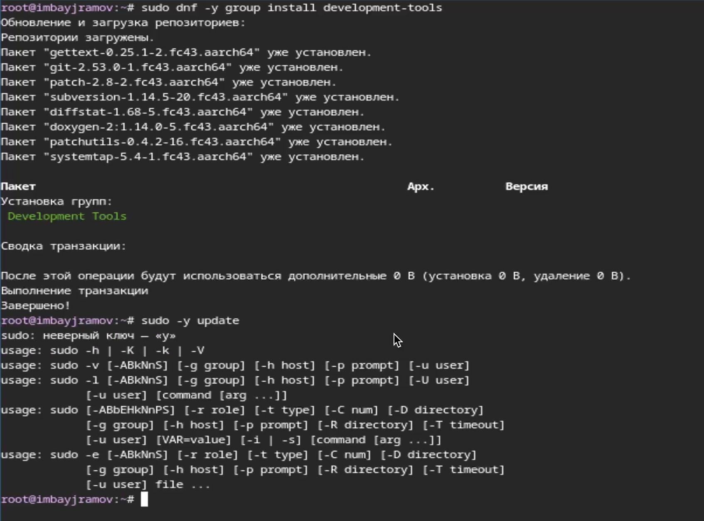
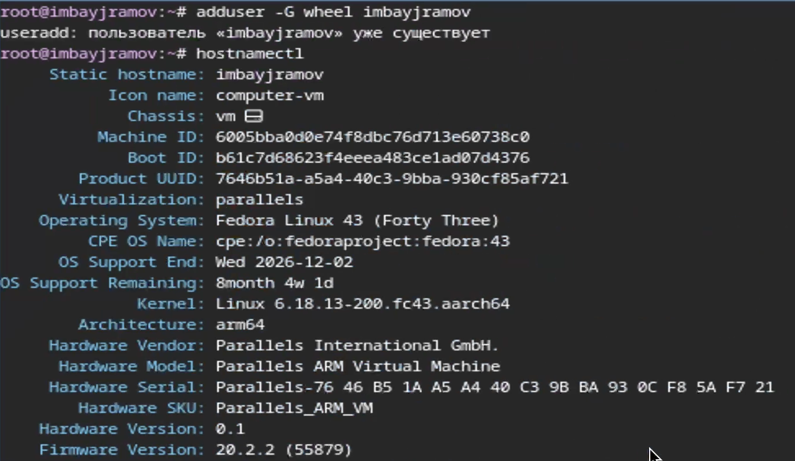
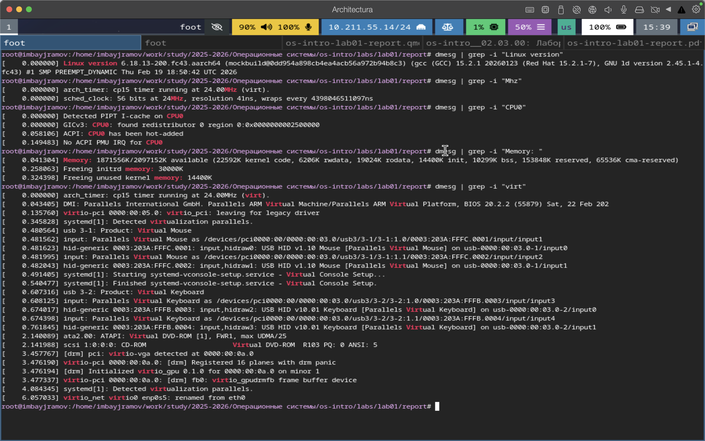
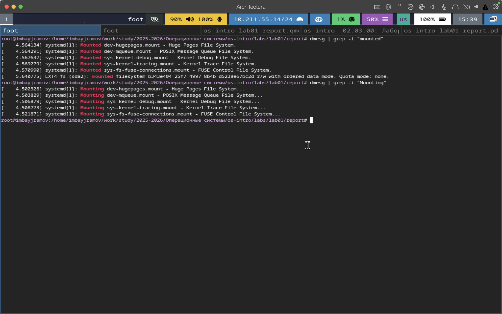

---
## Author
author:
 - Байрамов Исмаил Мухандис оглы
email: 
 - 1032253514@rudn.ru
institute:
 - Российский университет дружбы народов, Москва, Россия

## Title
title: Лабораторная работа №1
subtitle: Установка и настройка Linux в виртуальной машине
license: CC BY
date: today
date-format: "YYYY-MM-DD"
---

# Информация

## Докладчик

:::::::::::::: {.columns align=center}
::: {.column width="70%"}

* Байрамов Исмаил Мухандис оглы
* Студент РУДН
* Направление: Компьютерные и информационные науки
* Российский университет дружбы народов
* 1032253514@rudn.ru

:::
::: {.column width="30%"}

:::
::::::::::::::

# Вводная часть

## Цель работы

- Приобретение навыков установки Linux
- Настройка рабочей среды в виртуальной машине
- Установка инструментов разработки
- Освоение языка разметки Markdown

## Задание

1. Установить Linux в QEMU
2. Установить необходимые утилиты
3. Установить средства подготовки документации
4. Освоить Markdown

# Теоретическое введение

## Концепция виртуализации

- Виртуализация позволяет запускать несколько ОС на одном компьютере
- Обеспечивает изоляцию рабочих сред
- Эффективно использует ресурсы системы

## Средства виртуализации

**QEMU**
- эмулятор аппаратного обеспечения
- поддерживает работу с KVM

**VirtualBox**
- кроссплатформенный гипервизор
- удобный графический интерфейс

## Организация дискового пространства

Форматы виртуальных дисков:

- **qcow2** — формат QEMU с технологией Copy‑On‑Write
- **VDI** — формат VirtualBox
- поддержка динамического расширения диска

## Оконный менеджер Sway

- композитный менеджер Wayland
- тайлинговое размещение окон
- управление с клавиатуры
- высокая производительность

## SELinux

SELinux — механизм контроля доступа в Linux.

Режимы работы:

- enforcing
- permissive
- disabled

## Менеджер пакетов DNF

DNF используется для:

- установки программ
- обновления системы
- удаления пакетов
- автоматического разрешения зависимостей

## Средства подготовки документации

Используются следующие инструменты:

- **Markdown**
- **Pandoc**
- **LaTeX**

# Выполнение лабораторной работы

## Установка средств разработки

## Установка дополнительных программ

## Настройка SELinux

## Настройка конфигурационного файла

## Настройка пользователя

## Установка Pandoc

# Домашнее задание

## Информация о системе

## Информация о файловых системах

# Результаты

## Итоги выполнения работы

- установлена операционная система Linux
- настроена виртуальная среда
- установлены инструменты разработки
- освоены средства подготовки документации

# Заключение

## Вывод

В ходе лабораторной работы получены практические навыки:

- установки Linux в виртуальной машине
- работы с менеджером пакетов
- настройки системы
- подготовки технической документации.
