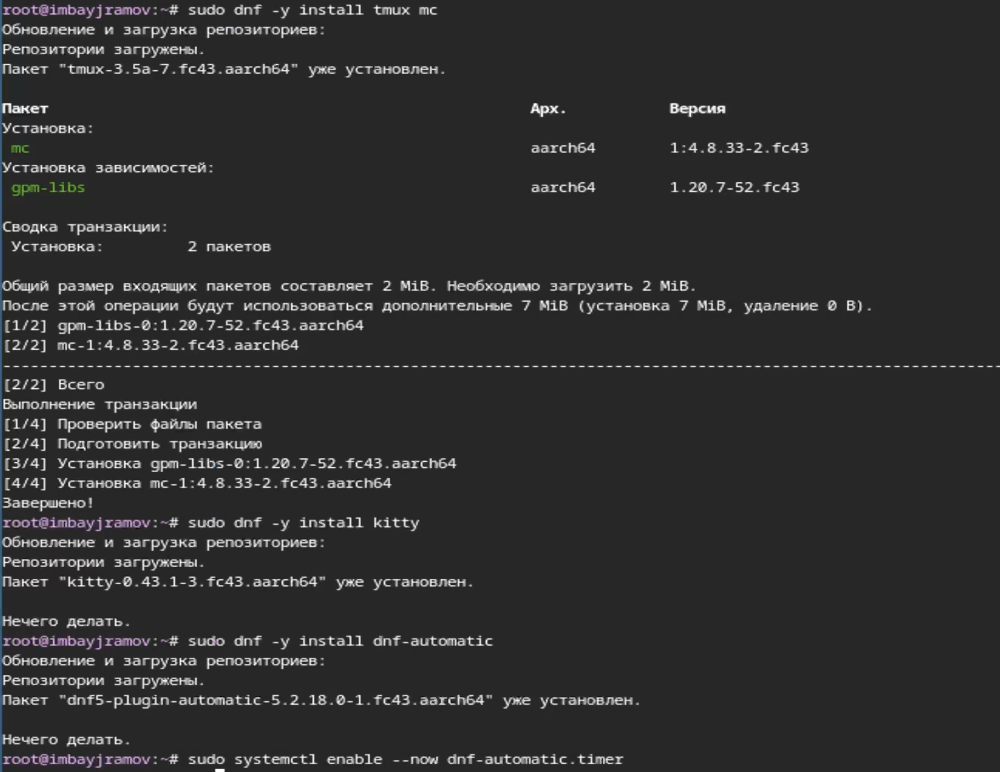
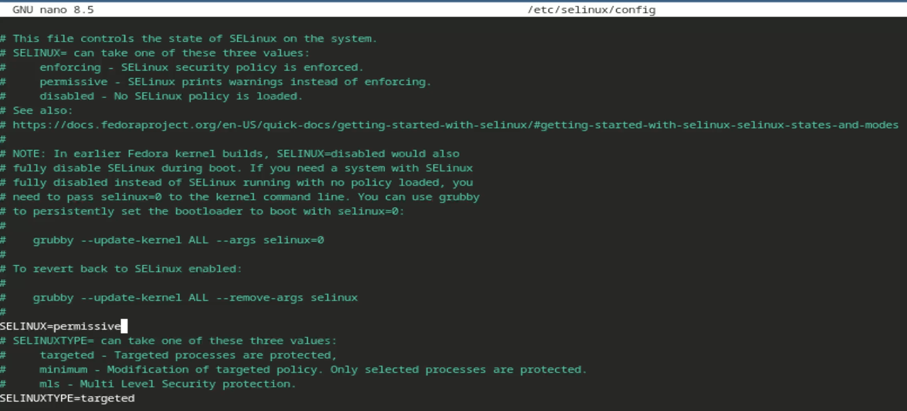
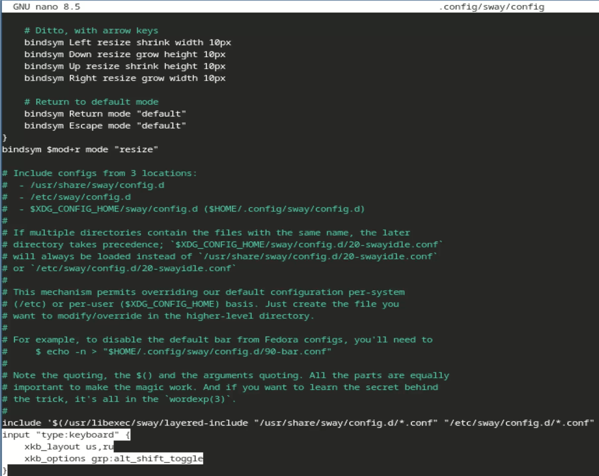
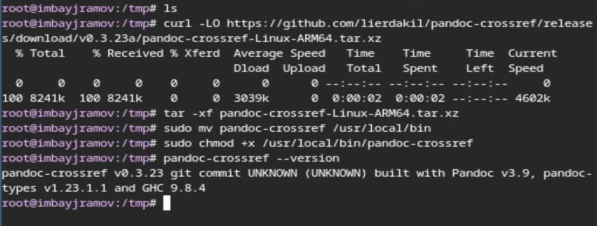

---
## Author
author:
  name: Байрамов Исмаил Мухандис оглы
  degrees: DSc
  orcid: 0000-0002-0877-7063
  email: 1032253514@rudn.ru
  affiliation:
    - name: Российский университет дружбы народов
      country: Российская Федерация
      postal-code: 117198
      city: Москва
      address: ул. Миклухо-Маклая, д. 6

## Title
title: "Отчет по лабораторной работе 1"
license: "CC BY"
---

# Цель работы

Целью данной работы является приобретение практических навыков установки операционной системы на виртуальную машину, настройки минимально необходимых для дальнейшей работы сервисов.

# Задание

1. Установка Linux на qemu
2. Установка необходимых для выполнения работ утилит
3. Установка программного обеспечения для создания документации
4. Работа с языком разметки Markdown

# Теоретическое введение

## Концепция виртуализации

**Виртуализация** — это технология создания программного представления (виртуального ресурса), такого как сервер, операционная система или устройство хранения. Она позволяет запускать несколько изолированных гостевых систем на одном физическом узле (хосте).

### Программные эмуляторы

В данной работе рассматриваются два ключевых инструмента:

1.  **QEMU (Quick Emulator):** Свободное ПО для эмуляции аппаратного обеспечения. В связке с гипервизором **KVM** (Kernel-based Virtual Machine) обеспечивает высокую производительность за счет прямого доступа к аппаратным ресурсам процессора.
2.  **VirtualBox:** Кроссплатформенный гипервизор второго типа. Он удобен для быстрой настройки сред через графический интерфейс и управления через утилиту командной строки `VBoxManage`.

## Организация дискового пространства

Для хранения данных виртуальных машин используются файлы образов, имитирующие физические жесткие диски:

* **qcow2 (QEMU Copy-On-Write):** Оптимизированный формат, который занимает место на реальном диске только по мере заполнения данными в виртуальной среде.
* **VDI (VirtualBox Disk Image):** Стандартный формат для сред VirtualBox.
* **Динамическое расширение:** Технология, позволяющая задать максимальный объем диска (например, 60 ГБ), при этом фактический размер файла образа в начале работы будет минимальным.

## Оконный менеджер Sway и протокол Wayland

**Sway** — это композитный менеджер Wayland, являющийся полноценной заменой i3 для протокола нового поколения. Его ключевые особенности:

* **Тайлинг (Tiling):** Автоматическое размещение окон в виде мозаики без взаимного перекрытия.
* **Клавиатурное управление:** Взаимодействие с системой осуществляется преимущественно через комбинации клавиш с использованием модификатора `$mod` (клавиша Super/Win).
* **Wayland:** Современный протокол связи между графическим сервером и приложениями, обеспечивающий повышенную безопасность и отсутствие «разрывов» изображения (tearing).

## Системные механизмы безопасности и управления

### SELinux (Security-Enhanced Linux)

Механизм контроля доступа, реализованный на уровне ядра. В учебных целях часто используется режим `permissive`, при котором действия, нарушающие политику безопасности, разрешаются, фиксируются но в системном журнале.

### Менеджер пакетов DNF
**DNF (Dandified YUM)** — основной инструмент управления программным обеспечением в Fedora. Он отвечает за разрешение зависимостей, установку, обновление и удаление пакетов из репозиториев.

## Средства подготовки документации

Современный цикл разработки включает автоматизацию создания отчетов:

1.  **Markdown:** Облегченный язык разметки, позволяющий создавать форматированный текст.
2.  **Pandoc:** «Универсальный швейцарский нож» для конвертации документов между форматами (Markdown, PDF, HTML, DOCX).
3.  **LaTeX (TeX Live):** Система высококачественного типографского набора, необходимая для рендеринга сложных математических формул и генерации итоговых PDF-файлов.

# Выполнение лабораторной работы

Установим все необходимые средства разработки и обновим все пакеты ([рис. @fig-001]).

{#fig-001 width=70%}

Установим для программы удобства работы в консоли и настроим автоматическое обновление ([рис. @fig-002]).

{#fig-002 width=70%}

Отключим систему безопасности SELinux ([рис. @fig-003]).

{#fig-003 width=70%}

Добавим русскую раскладку клавиатуры с помощью редактирования config-файла ([рис. @fig-004]).

{#fig-004 width=70%}

Установим имя пользователя и название хоста, затем проверим при помощи команды hostnamectl ([рис. @fig-005]).

{#fig-005 width=70%}

Установим средство pandoc для работы с языком разметки Markdown. Установка проходит с помощью менеджера пакетов. Также нам необходимо с github установить pandoc-crossref нужной нам версии ([рис. @fig-006]).

{#fig-006 width=70%}

# Выполнение домашней работы

Для выполнения этого домашнего задания вам понадобится терминал и команда dmesg, которая выводит сообщения кольцевого буфера ядра (лог загрузки и работы системы).

Выполним все необходимые команды для вывода информации о нашей системе ([рис. @fig-007]).

{#fig-007 width=70%}

{#fig-008 width=70%}

# Ответы на контрольные вопросы

## 1. Какую информацию содержит учётная запись пользователя?

Учётная запись пользователя в *Unix/Linux* обычно включает:

- **Имя пользователя (login)** — строковый идентификатор.
- **UID** (*User ID*) — числовой уникальный идентификатор пользователя.
- **GID** (*Primary Group ID*) — идентификатор основной группы.
- **Домашний каталог** (например, `/home/ivan`) — место хранения личных файлов и настроек.
- **Командная оболочка (shell)** по умолчанию (например, `/bin/bash`, `/bin/zsh`).
- **Пароль/хэш пароля** и параметры аутентификации (хранятся не в открытом виде; обычно в `/etc/shadow`).
- **Список групп**, в которые входит пользователь (дополнительные права).
- **Описание/комментарий** (поле GECOS: ФИО, телефон и т.п. — опционально).
- **Права и ограничения**: политика пароля, срок действия, лимиты ресурсов (например, `ulimit`), sudo-права.
- **Профиль и переменные окружения** (например, `.bashrc`, `.profile`) — настройки сессии.

Где это хранится/смотрится:
- Основные поля учёток: `/etc/passwd`
- Хэши паролей и срок действия: `/etc/shadow`
- Группы: `/etc/group`
- Просмотр: `id`, `getent passwd <user>`, `groups <user>`

## 2. Укажите команды терминала и приведите примеры

### 2.1 Для получения справки по команде
- `man <команда>` — подробная справка  
  Пример: `man ls`
- `<команда> --help` — краткая справка по ключам  
  Пример: `cp --help`
- `help <встроенная_команда>` — для встроенных команд bash  
  Пример: `help cd`
- `apropos <слово>` — поиск по описаниям man-страниц  
  Пример: `apropos archive`

### 2.2 Для перемещения по файловой системе
- `pwd` — показать текущий каталог  
  Пример: `pwd`
- `cd <путь>` — перейти в каталог  
  Примеры:
  - `cd /var/log`
  - `cd ..` (на уровень выше)
  - `cd ~` (домой)

### 2.3 Для просмотра содержимого каталога
- `ls` — список файлов/каталогов  
  Примеры:
  - `ls`
  - `ls -l` (подробно)
  - `ls -la` (включая скрытые)

### 2.4 Для определения объёма каталога
- `du` — оценка занимаемого места  
  Примеры:
  - `du -sh /home/ivan` (итого, “человеческий” вид)
  - `du -h --max-depth=1 /var` (по подпапкам)

### 2.5 Для создания / удаления каталогов / файлов
**Каталоги**
- `mkdir <каталог>` — создать каталог  
  Пример: `mkdir projects`
- `mkdir -p a/b/c` — создать дерево каталогов  
  Пример: `mkdir -p backups/2026/03`
- `rmdir <пустой_каталог>` — удалить пустой каталог  
  Пример: `rmdir old_empty_dir`
- `rm -r <каталог>` — удалить каталог рекурсивно (осторожно!)  
  Пример: `rm -r tmp_folder`

**Файлы**
- `touch <файл>` — создать пустой файл/обновить время  
  Пример: `touch notes.txt`
- `cp <источник> <назначение>` — копировать  
  Пример: `cp report.txt report.bak`
- `mv <источник> <назначение>` — переместить/переименовать  
  Пример: `mv draft.txt final.txt`
- `rm <файл>` — удалить файл  
  Пример: `rm notes.txt`

> ⚠️ Команды `rm -r` и особенно `rm -rf` необратимо удаляют данные — проверяйте путь.

### 2.6 Для задания определённых прав на файл / каталог
- `chmod` — изменить права доступа  
  Примеры:
  - `chmod 644 file.txt` (rw-r--r--)
  - `chmod u+x script.sh` (добавить выполнение владельцу)
  - `chmod -R 755 dir/` (рекурсивно для каталога)
- `chown` — изменить владельца/группу  
  Примеры:
  - `sudo chown ivan file.txt`
  - `sudo chown -R ivan:dev dir/`
- `chgrp` — сменить только группу  
  Пример: `sudo chgrp dev file.txt`
- `umask` — маска прав по умолчанию для новых файлов  
  Пример: `umask 022`

### 2.7 Для просмотра истории команд
- `history` — показать историю команд текущей оболочки  
  Примеры:
  - `history`
  - `history | tail -n 20`
- Поиск по истории:
  - `history | grep ssh`
  - В bash: `Ctrl+R` (интерактивный поиск назад)
- Файл истории (часто):
  - Bash: `~/.bash_history`
  - Zsh: `~/.zsh_history`

## 3. Что такое файловая система? Примеры с краткой характеристикой

**Файловая система** — это способ организации хранения данных на носителе (диск, флешка, SSD) и правила, по которым ОС создаёт, читает, изменяет и удаляет файлы/каталоги, хранит метаданные (права, владельцев, время, структуру каталогов и т.д.).

Примеры:

- **ext4 (Linux)** — очень распространённая журнальная ФС, хорошая надёжность и производительность.
- **XFS (Linux)** — эффективна на больших объёмах и при больших файлах, хорошо масштабируется.
- **Btrfs (Linux)** — поддерживает снапшоты, checksums, сжатие; удобна для откатов, но требует аккуратной настройки.
- **ZFS (кроссплатформенная)** — высокая целостность данных (checksums), снапшоты, пулы дисков; популярна на серверах/NAS.
- **NTFS (Windows)** — стандартная ФС Windows (права, журналирование); в Linux обычно доступна через драйвер.
- **FAT32 / exFAT** — часто для флешек/карт памяти; высокая совместимость, но разные ограничения (например, FAT32 — лимит размера файла ~4 ГБ).
- **tmpfs** — временная ФС в оперативной памяти; очень быстро, но данные исчезают после перезагрузки.

## 4. Как посмотреть, какие файловые системы подмонтированы в ОС?

Частые варианты (Linux/Unix):

- `mount` — покажет все текущие монтирования  
  Пример: `mount | less`
- `findmnt` — удобный вывод деревом и фильтрация  
  Примеры:
  - `findmnt`
  - `findmnt -t ext4,xfs`
- `df -Th` — список точек монтирования + тип ФС + занято/свободно  
  Пример: `df -Th`
- Просмотр напрямую из procfs:  
  - `cat /proc/mounts`
  - `cat /etc/mtab` (может быть ссылкой/производным)

## 5. Как удалить зависший процесс?

1) Посмотреть процессы и найти PID:
- `ps aux | grep <имя>`  
  Пример: `ps aux | grep firefox`
- или интерактивно:
  - `top`
  - `htop` (если установлен)

2) Завершить процесс сигналом:
- Мягко (просим завершиться):  
  `kill <PID>` (по умолчанию SIGTERM)  
  Пример: `kill 12345`

- Если не завершился:
  `kill -9 <PID>` (SIGKILL, принудительно)  
  Пример: `kill -9 12345`

3) По имени процесса (если PID неизвестен):
- `pkill <имя>`  
  Пример: `pkill firefox`
- `killall <имя>` (в зависимости от ОС/настроек)  
  Пример: `killall firefox`

Полезно:
- `kill -l` — список сигналов.
- Старайтесь сначала использовать SIGTERM, и только если не помогает — SIGKILL (`-9`).

# Выводы

В ходе выполнения лабораторной работы 1 мы приобрели практические навыки установки операционной системы на виртуальную машину, настройки минимально необходимых для дальнейшей работы сервисов.

