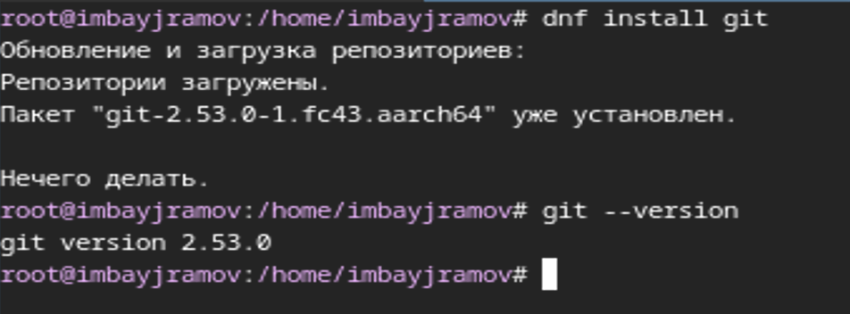
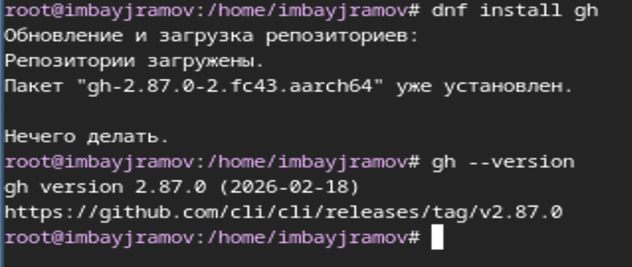
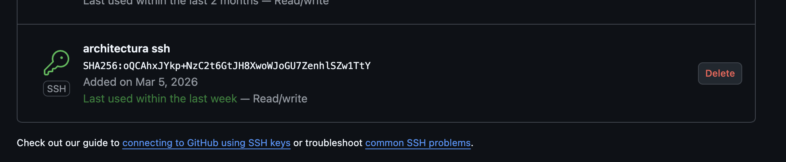
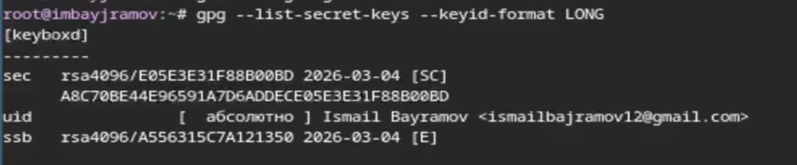
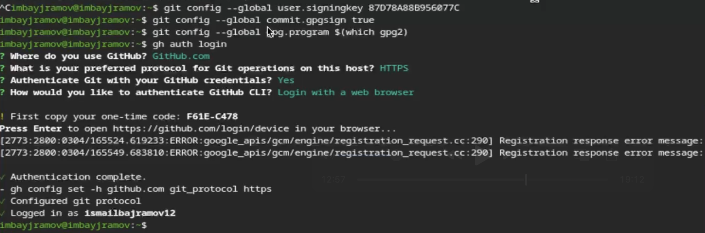

---
## Author
author:
 - Байрамов Исмаил Мухандис оглы
email:
 - 1032253514@rudn.ru
institute:
 - Российский университет дружбы народов, Москва, Россия
 
## Title
title: Лабораторная работа №2
subtitle: Первоначальная настройка Git
license: CC BY
date: today
date-format: "YYYY-MM-DD"
---

# Информация

## Докладчик
:::::::::::::: {.columns align=center}
::: {.column width="70%"}
* Байрамов Исмаил Мухандис оглы
* Студент РУДН
* Направление: Компьютерные и информационные науки
* Российский университет дружбы народов
* 1032253514@rudn.ru
:::
::: {.column width="30%"}

:::
::::::::::::::

# Вводная часть

## Цель работы
- Изучить идеологию систем контроля версий
- Освоить работу с системой **Git**
- Выполнить первоначальную настройку Git
- Создать SSH и PGP ключи
- Настроить подпись коммитов

## Задание
1. Установить `git` и `gh`
2. Выполнить базовую настройку git
3. Создать SSH-ключ и добавить его в GitHub
4. Создать PGP-ключ
5. Настроить подпись коммитов
6. Создать репозиторий курса
7. Отправить изменения в GitHub

# Теоретическое введение

## Системы контроля версий
**VCS (Version Control System)** — система управления изменениями файлов.
Позволяет:
- хранить историю изменений
- отслеживать автора изменений
- работать над проектом нескольким разработчикам
- возвращаться к предыдущим версиям

## Типы систем контроля версий
### Централизованные
Примеры:
- CVS
- Subversion
Особенности:
- один центральный сервер
- пользователи отправляют изменения на сервер
### Распределённые
Примеры:
- Git
- Mercurial
Особенности:
- каждый пользователь имеет полный репозиторий
- можно работать без сервера

# Git

## Основные команды Git
Основные команды:
```
git init
git status
git add
git commit
git pull
git push
```
Дополнительные команды:
```
git checkout -b branch
git merge
git diff
```
# Переносы строк
## Настройка окончаний строк
В разных ОС используются разные символы перевода строки:
Windows:
```
CRLF
```
Linux / Unix:
```
LF
```
Настройка Git:
```
git config --global core.autocrlf input
```
Проверка:
```
git ls-files --eol
```
# SSH ключи
## SSH аутентификация
SSH-ключ используется для безопасного доступа к GitHub.
Состоит из:
- приватного ключа
- публичного ключа
Генерация ключа:
```
ssh-keygen -t rsa -b 4096
```
или
```
ssh-keygen -t ed25519
```
# PGP подпись коммитов
## Зачем нужна подпись
PGP-подпись позволяет:
- подтвердить автора коммита
- защитить историю изменений
- отображать статус **Verified** в GitHub
Создание ключа:
```
gpg --full-generate-key
```
Просмотр ключей:
```
gpg --list-secret-keys --keyid-format LONG
```

# Выполнение лабораторной

## Установка Git
Установка:
```
sudo dnf install git
```
Проверка версии:
```
git --version
```


# Установка GitHub CLI

```
sudo dnf install gh
```
Проверка:
```
gh --version
```


# Базовая настройка Git

Настройка имени и email:
```
git config --global user.name "Ismail Bayramov"
git config --global user.email "ismailbajramov12@gmail.com"
```
Настройка UTF-8:
```
git config --global core.quotepath false
```


# Настройка переносов строк

```
git config --global init.defaultBranch master
git config --global core.autocrlf input
git config --global core.safecrlf warn
```


# SSH ключи

Создание ключей:
```
ssh-keygen -t rsa -b 4096
ssh-keygen -t ed25519
```
Добавление ключа в GitHub:
```
xclip -i < ~/.ssh/id_ed25519.pub
```

# PGP ключ
Создание ключа:
```
gpg --full-generate-key
```
Просмотр ключей:
```
gpg --list-secret-keys --keyid-format LONG
```

# Добавление ключа в GitHub
Экспорт ключа:
```
gpg --armor --export <fingerprint>
```
Добавление ключа в GitHub:
Settings → SSH and GPG keys

# Подпись коммитов
Настройка автоматической подписи:
```
git config --global user.signingkey <fingerprint>
git config --global commit.gpgsign true
git config --global gpg.program $(which gpg2)
```
Создание подписанного коммита:
```
git commit -S -m "signed commit"
```

# GitHub CLI
Авторизация:
```
gh auth login
```
Создание репозитория:
```
gh repo create study_2025-2026_os-intro
```
Клонирование:
```
git clone [git@github.com](mailto:git@github.com):ismailbajramov12/study_2025-2026_os-intro.git
```

# Результаты

В ходе лабораторной работы:
- установлены **git и gh**
- выполнена **базовая настройка git**
- создан **SSH ключ**
- создан **PGP ключ**
- настроена **подпись коммитов**
- создан **репозиторий курса**
- выполнена **отправка изменений на GitHub**

# Вывод

В результате лабораторной работы были изучены основные принципы работы системы контроля версий **Git**.
Получены практические навыки:
- настройки Git
- работы с GitHub
- создания SSH и PGP ключей
- подписания коммитов
- создания и управления репозиториями.
