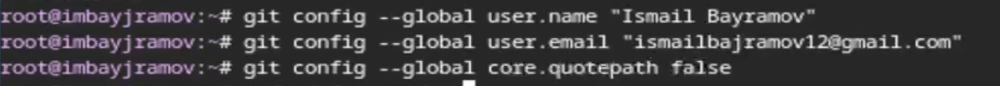
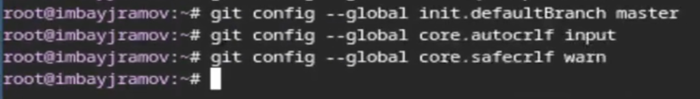
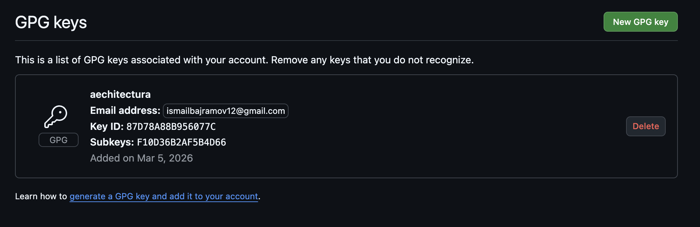

---
## Author
author:
  name: Байрамов Исмаил Мухандис оглы
  email: 1032253514@rudn.ru
  affiliation:
    - name: Российский университет дружбы народов
      country: Российская Федерация
      postal-code: 117198
      city: Москва
      address: ул. Миклухо-Маклая, д. 6

## Title
title: "Отчет по лабораторной работе 2"
license: "CC BY"
---

# Цель работы

Изучить идеологию и применение средств контроля версий. Освоить умения по работе с **git**, включая первичную настройку, создание SSH-ключей и настройку подписи коммитов с помощью PGP.

# Задание

1. Установить программное обеспечение: `git`, `gh` (GitHub CLI).
2. Выполнить базовую настройку `git` (имя, email, настройки отображения путей и переносов строк).
3. Создать SSH-ключи и добавить публичный ключ в GitHub.
4. Создать PGP-ключ, добавить его в GitHub и настроить автоматическое подписание коммитов.
5. Авторизоваться в `gh`.
6. Создать репозиторий курса на основе шаблона и подготовить структуру каталога курса.
7. Зафиксировать и отправить изменения в удалённый репозиторий.

# Теоретическое введение


## Системы контроля версий

**Система контроля версий (Version Control System, VCS)** — это программное обеспечение, позволяющее фиксировать изменения в файлах проекта, хранить историю, объединять изменения нескольких участников и при необходимости возвращаться к любой из предыдущих версий.

Существуют два основных подхода:

- **Централизованные VCS** (например, CVS, Subversion): основной репозиторий хранится на сервере, а пользователь получает рабочую копию и отправляет изменения на сервер.
- **Распределённые VCS** (например, Git, Mercurial): у каждого участника есть полный локальный репозиторий с историей; центральный сервер используется как точка обмена.

## Git и основные команды

Git — распределённая система контроля версий, предоставляющая набор консольных утилит `git`.

Чаще всего используются команды:

- `git init` — создать репозиторий;
- `git status` — показать состояние рабочей директории;
- `git diff` — показать изменения;
- `git add` — добавить изменения в индекс;
- `git commit` — зафиксировать изменения;
- `git pull` — получить изменения из удалённого репозитория;
- `git push` — отправить изменения в удалённый репозиторий;
- `git checkout -b <branch>` — создать и переключиться на новую ветку;
- `git merge` — слить ветки.

## Учёт переносов строк

В разных ОС используются разные окончания строк:

- Windows: `CRLF` (`\r\n`);
- Unix/Linux: `LF` (`\n`);
- Classic Mac: `CR` (`\r`).

Для унификации используется настройка:

- `core.autocrlf true` — обычно для Windows (конвертация при commit и checkout);
- `core.autocrlf input` — обычно для Linux/macOS (конвертация только при commit).

Проверка EOL в репозитории:

```bash
git ls-files --eol
```

## SSH-аутентификация

Для безопасного доступа к GitHub по протоколу SSH используется пара ключей: **приватный** (хранится на ПК) и **публичный** (добавляется в GitHub).

Примеры генерации ключей:

```bash
ssh-keygen -t rsa -b 4096
ssh-keygen -t ed25519
```

## PGP-подпись коммитов

Подпись коммитов позволяет подтвердить, что коммит сделан владельцем соответствующего ключа (коммитером). Для генерации ключа используется `gpg`:

```bash
gpg --full-generate-key
```

Ключ экспортируется в ASCII-формате и добавляется в GitHub. Для автоматической подписи коммитов в `git` задаются параметры `user.signingkey` и `commit.gpgsign`.

# Выполнение лабораторной работы

## Установка программного обеспечения

Установим `git` и проверим версию ([рис. @fig-001]):

```bash
sudo dnf install git
git --version
```

{#fig-001 width=70%}

Установим GitHub CLI `gh` ([рис. @fig-002]):

```bash
sudo dnf install gh
gh --version
```

{#fig-002 width=70%}

## Базовая настройка git

Зададим имя и email владельца репозитория, а также корректный вывод путей в UTF-8 ([рис. @fig-003]):

```bash
git config --global user.name "Name Surname"
git config --global user.email "work@mail"
git config --global core.quotepath false
```

{#fig-003 width=70%}

Зададим имя начальной ветки и параметры переносов строк ([рис. @fig-004]):

```bash
git config --global init.defaultBranch master
git config --global core.autocrlf input
git config --global core.safecrlf warn
```

{#fig-004 width=70%}

## Создание SSH-ключей и настройка GitHub

Сгенерируем SSH-ключи RSA и Ed25519:

```bash
ssh-keygen -t rsa -b 4096
ssh-keygen -t ed25519
```

Скопируем публичный ключ и добавим его в GitHub (Settings → SSH and GPG keys → New SSH key) ([рис. @fig-006]):

```bash
xclip -i < ~/.ssh/id_ed25519.pub
```

{#fig-006 width=70%}

## Создание PGP-ключа и подпись коммитов

Сгенерируем PGP-ключ:

```bash
gpg --full-generate-key
```

Посмотрим список секретных ключей и получим отпечаток (fingerprint) ([рис. @fig-008]):

```bash
gpg --list-secret-keys --keyid-format LONG
```

{#fig-008 width=70%}

Экспортируем публичный PGP-ключ и добавим его в GitHub (Settings → SSH and GPG keys → New GPG key) ([рис. @fig-009]):

```bash
gpg --armor --export <PGP_FINGERPRINT> | xclip -sel clip
```

{#fig-009 width=70%}

Настроим автоматическое подписание коммитов ([рис. @fig-010]):

```bash
git config --global user.signingkey <PGP_FINGERPRINT>
git config --global commit.gpgsign true
git config --global gpg.program $(which gpg2)
```

Проверка: создадим подписанный коммит вручную:

```bash
git commit -S -m "test: signed commit"
```

{#fig-010 width=70%}

## Настройка gh и создание репозитория курса

Авторизуемся в GitHub CLI:

```bash
gh auth login
```

Создадим рабочий каталог курса:

```bash
mkdir -p ~/work/study/2025-2026/"Операционные системы"
cd ~/work/study/2025-2026/"Операционные системы"
```

Создадим репозиторий по шаблону и клонируем его локально:

```bash
gh repo create study_2025-2026_os-intro --template=yamadharma/course-directory-student-template --public
git clone --recursive git@github.com:ismailbajramov12/study_2025-2026_os-intro.git os-intro
```

Настроим структуру курса:

```bash
cd os-intro
rm package.json
echo os-intro > COURSE
make prepare
git add .
git commit -am "feat(main): make course structure"
git push
```

# Ответы на контрольные вопросы

1. **Что такое VCS и для каких задач предназначаются?**  
   VCS предназначены для фиксации изменений, хранения истории, совместной работы и отката к прошлым версиям.

2. **Поясните понятия: хранилище, commit, история, рабочая копия.**  
   Хранилище — репозиторий с историей. Commit — фиксация изменений. История — цепочка commit. Рабочая копия — текущее состояние файлов на диске.

3. **Чем отличаются централизованные и распределённые VCS? Примеры.**  
   Централизованные: один сервер (SVN). Распределённые: полная копия у каждого (Git).

4. **Действия при единоличной работе с хранилищем.**  
   Изменения → `git add` → `git commit` → (при необходимости) `git push`.

5. **Порядок работы с общим хранилищем.**  
   `git pull` → создать ветку → изменения → commit → `git push` → merge.

6. **Основные задачи git.**  
   Управление версиями, ветвление, объединение изменений, работа локально и с удалённым репозиторием.

7. **Назовите команды git и дайте краткую характеристику.**  
   `init`, `status`, `diff`, `add`, `commit`, `pull`, `push`, `checkout`, `merge`, `branch`.

8. **Примеры использования с локальным и удалённым репозиториями.**  
   Локально: `git init`, `git add`, `git commit`. Удалённо: `git remote add`, `git push`, `git pull`.

9. **Что такое ветви (branches) и зачем нужны?**  
   Ветки — независимые линии разработки, позволяют вести параллельную работу (например, фичи/исправления) без влияния на основную ветку.

10. **Как и зачем игнорировать файлы?**  
    Через `.gitignore`, чтобы не коммитить временные/генерируемые файлы (логи, сборки и т.п.).

# Выводы

В ходе лабораторной работы была изучена основа работы с системой контроля версий **Git**: выполнена установка и первичная настройка, настроена работа с GitHub через **SSH**, создан и добавлен **PGP-ключ** для подписи коммитов, а также настроено автоматическое подписание коммитов. Создано рабочее пространство и репозиторий курса на основе шаблона, выполнена первоначальная инициализация структуры и отправка изменений на сервер.

