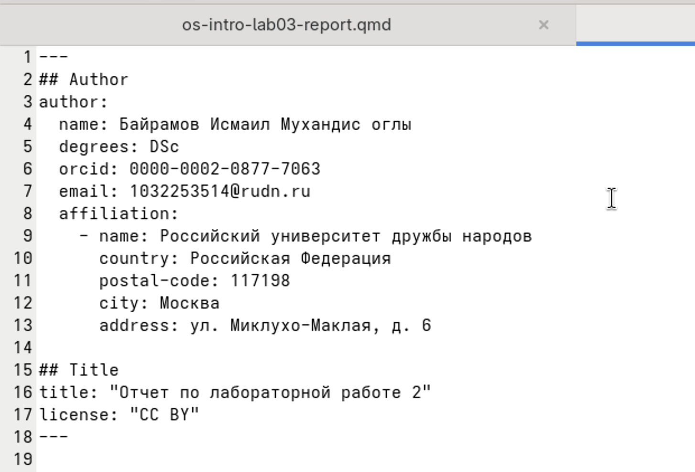

---
## Author
author:
  name: Байрамов Исмаил Мухандис оглы
  email: 1032253514@rudn.ru
  affiliation:
    - name: Российский университет дружбы народов
      country: Российская Федерация
      postal-code: 117198
      city: Москва
      address: ул. Миклухо-Маклая, д. 6

## Title
title: "Отчет по лабораторной работе 3"
license: "CC BY"
---

# Информация

## Докладчик

:::::::::::::: {.columns align=center}
::: {.column width="70%"}
* Байрамов Исмаил Мухандис оглы
* Студент РУДН
* Направление: Компьютерные и информационные науки
* Российский университет дружбы народов
* 1032253514@rudn.ru
:::
::: {.column width="30%"}

:::
::::::::::::::

# Вводная часть

## Цель работы

- Изучить язык разметки **Markdown**
- Освоить основные элементы форматирования текста
- Научиться оформлять отчёты в Markdown
- Научиться конвертировать Markdown в **PDF** и **DOCX**

## Задание

1. Изучить синтаксис Markdown
2. Создать отчёт по предыдущей лабораторной работе
3. Использовать элементы Markdown (заголовки, списки, код)
4. Конвертировать файл в PDF и DOCX с помощью Pandoc

# Теоретическое введение

## Что такое Markdown

**Markdown** — лёгкий язык разметки текста.

Позволяет:

- структурировать документ
- добавлять форматирование
- вставлять код и формулы
- конвертировать документ в различные форматы

## Основные элементы Markdown

### Заголовки

```
# Заголовок
## Подзаголовок
### Подраздел
```

### Выделение текста

```
**жирный**
*курсив*
***жирный курсив***
```

## Списки

Маркированный список:

```
- элемент 1
- элемент 2
- элемент 3
```

Нумерованный список:

```
1. элемент
2. элемент
3. элемент
```

## Ссылки и код

Ссылка:

```
[GitHub](https://github.com)
```

Блок кода:

```
```bash
git status
```
```

## Формулы

Markdown поддерживает LaTeX.

Пример:

```
$\sin^2(x) + \cos^2(x) = 1$
```

# Выполнение лабораторной работы

Был создан файл:

```
report.md
```

В котором оформлены:

- цель работы
- задание
- теоретическая часть
- вывод

## Проверка отображения

Проверено отображение Markdown документа:

- корректная структура
- списки
- код
- формулы


## Конвертация Pandoc

Для преобразования Markdown использован **Pandoc**

PDF:

```
pandoc report.md -o report.pdf
```

DOCX:

```
pandoc report.md -o report.docx
```



## Использование Makefile

Для автоматизации сборки использован **Makefile**

```
make
```

Создаются файлы:

- report.pdf
- report.docx


# Результаты

В ходе работы:

- изучен язык **Markdown**
- освоены основные элементы разметки
- создан Markdown отчёт
- выполнена конвертация в PDF и DOCX

# Вывод

В ходе лабораторной работы был изучен язык разметки **Markdown**.

Получены навыки cоздания Markdown документов, использования Pandoc и автоматизации сборки отчётов.

