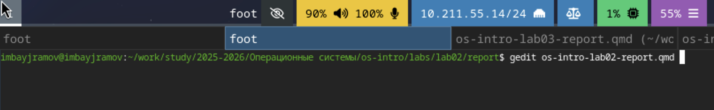
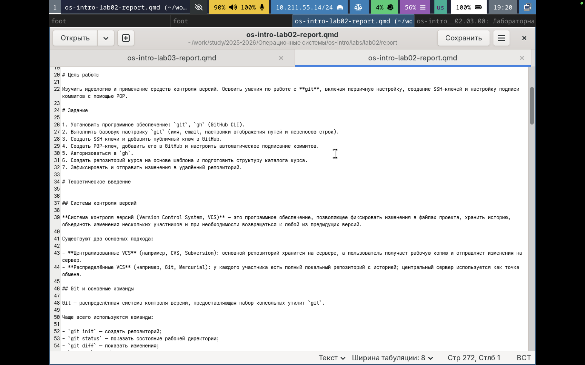
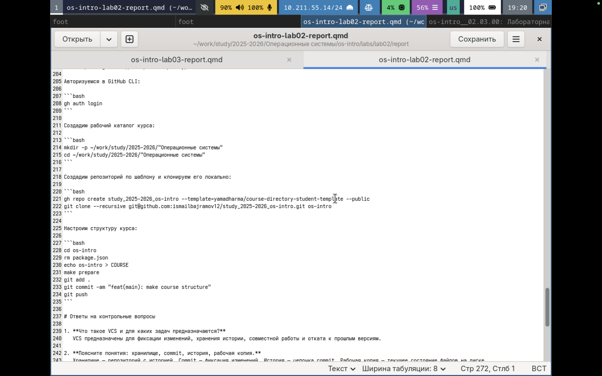

---
## Author
author:
  name: Байрамов Исмаил Мухандис оглы
  email: 1032253514@rudn.ru
  affiliation:
    - name: Российский университет дружбы народов
      country: Российская Федерация
      postal-code: 117198
      city: Москва
      address: ул. Миклухо-Маклая, д. 6

## Title
title: "Отчет по лабораторной работе 3"
license: "CC BY"
---

# Цель работы

Научиться оформлять отчёты с помощью легковесного языка разметки Markdown.

# Задание

1. Изучить базовый синтаксис Markdown: заголовки, списки, форматирование, ссылки, код, формулы.
2. Подготовить отчёт по предыдущей лабораторной работе в формате Markdown.
3. Сконвертировать отчёт в форматы **PDF**, **DOCX** и **MD** с использованием **Pandoc** (при необходимости — через `Makefile`).
4. В отчёте привести примеры использованных конструкций Markdown и результаты преобразования.

# Теоретическое введение

## Что такое Markdown

**Markdown** — легковесный язык разметки, предназначенный для быстрого и удобного оформления текстовых документов. Он используется для README-файлов, документации, отчётов и статей. Основное преимущество — простота синтаксиса и возможность преобразования в различные форматы (PDF, DOCX, HTML) с помощью конвертеров, например **Pandoc**.

## Основные элементы Markdown

### Заголовки

```markdown
# Заголовок 1
## Заголовок 2
### Заголовок 3
#### Заголовок 4
```

### Выделение текста

```markdown
**полужирный**
*курсив*
***полужирный курсив***
```

### Цитаты

```markdown
> Это пример блока цитирования.
```

### Списки

Маркированный:

```markdown
- пункт 1
- пункт 2
  - вложенный пункт
```

Нумерованный:

```markdown
1. шаг 1
2. шаг 2
   1. подшаг
```

### Ссылки

```markdown
[GitHub](https://github.com)
```

### Код

Встроенный код:

```markdown
Команда `git status` показывает состояние репозитория.
```

Огражденный блок кода:

````markdown
```bash
git status
```
````

### Формулы

Внутритекстовая формула:

```markdown
$\sin^2(x) + \cos^2(x) = 1$
```

Выключная формула:

```markdown
$$
\sin^2(x) + \cos^2(x) = 1
$$
```

# Выполнение лабораторной работы

В рабочей директории курса я открываю через текстовый редактор (gedit) файл с шаблоном отчета. (рис. -@fig:001)

{#fig:001 width=70%}

Указываю основную информацию о лабораторной работе. (рис. -@fig:002)

{#fig:002 width=70%}

Формирую цель работы, задание и заполняю теоретическое введение. (рис. -@fig:003)

{#fig:003 width=70%}

Описываю процесс выполнения лабораторной работы. (рис. -@fig:004)

{#fig:004 width=70%}

# Выводы

В ходе лабораторной работы был изучен синтаксис Markdown и выполнено оформление отчёта с использованием основных элементов разметки. Также освоено преобразование Markdown-документов в форматы **PDF** и **DOCX** с помощью **Pandoc**, а также автоматизация сборки через **Makefile**. Полученные навыки позволяют эффективно готовить отчёты и документацию в едином исходном формате с последующей конвертацией под требуемый стандарт.

