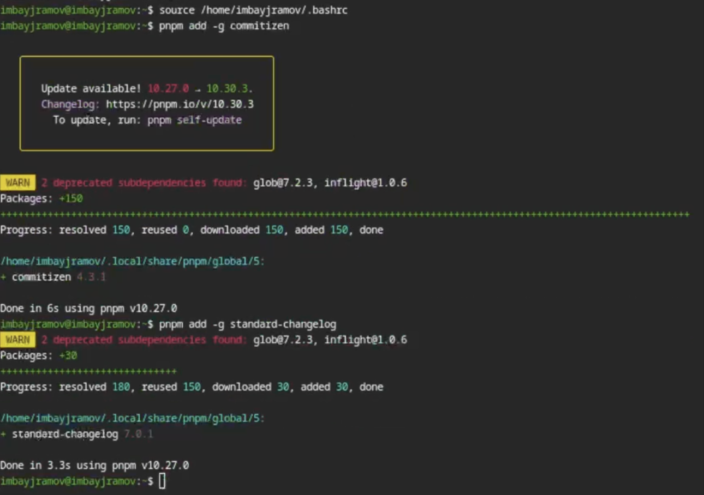
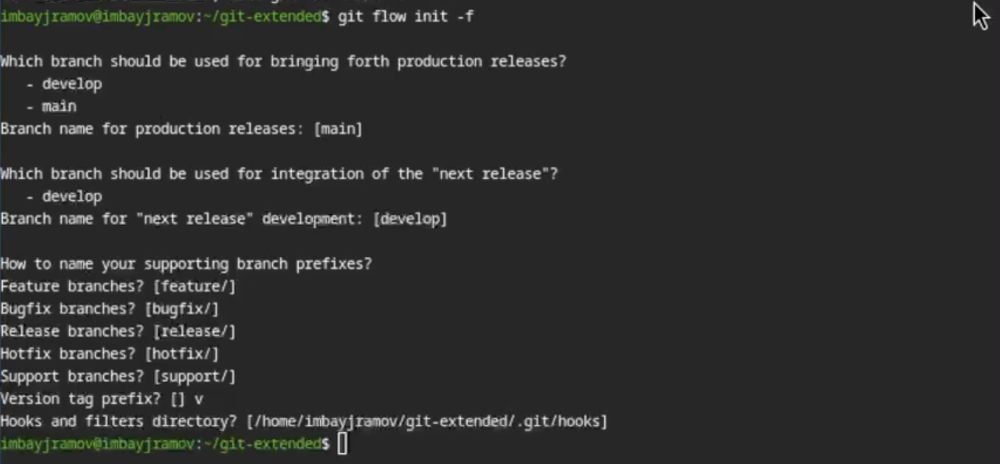

---
## Author
author:
  name: Байрамов Исмаил Мухандис оглы
  email: 1032253514@rudn.ru
  affiliation:
    - name: Российский университет дружбы народов
      country: Российская Федерация
      postal-code: 117198
      city: Москва
      address: ул. Миклухо-Маклая, д. 6

## Title
title: "Отчет по лабораторной работе 3"
license: "CC BY"
---

# Информация

## Докладчик

:::::::::::::: {.columns align=center}
::: {.column width="70%"}

* Байрамов Исмаил Мухандис оглы
* Студент РУДН
* Направление: Компьютерные и информационные науки
* Российский университет дружбы народов
* 1032253514@rudn.ru

:::
::: {.column width="30%"}


:::
::::::::::::::

# Вводная часть

## Цель работы

- Получить навыки продвинутой работы с репозиториями **Git**
- Освоить модель ветвления **Gitflow**
- Изучить **SemVer** и **Conventional Commits**
- Научиться оформлять релизы и changelog

## Задание

1. Выполнить работу на тестовом репозитории
2. Перевести проект на **git-flow**
3. Настроить **conventional commits**
4. Подготовить релиз и журнал изменений

# Теоретическое введение

## Модель Gitflow

**Gitflow** — это модель организации процесса разработки с использованием нескольких веток.

Основные ветки:

- **master** — стабильные релизы
- **develop** — основная ветка разработки

Дополнительные ветки:

- **feature** — новая функциональность
- **release** — подготовка релиза
- **hotfix** — срочные исправления

# Основные команды Gitflow

Инициализация:

```bash
git flow init
```

Создание feature-ветки:

```bash
git flow feature start feature_name
git flow feature finish feature_name
```

Работа с release:

```bash
git flow release start 1.0.0
git flow release finish 1.0.0
```

Работа с hotfix:

```bash
git flow hotfix start hotfix_name
git flow hotfix finish hotfix_name
```

# Семантическое версионирование

Версия задаётся в формате:

```text
MAJOR.MINOR.PATCH
```

Где:

- **MAJOR** — несовместимые изменения
- **MINOR** — новая функциональность
- **PATCH** — исправление ошибок

SemVer позволяет удобно управлять версиями релизов проекта.

# Conventional Commits

Conventional Commits — это соглашение о формате сообщений коммитов.

Общий вид:

```text
<type>(<scope>): <description>
```

Типы коммитов:

- **feat** — новая функция
- **fix** — исправление ошибки
- **docs** — документация
- **refactor** — рефакторинг
- **test** — тесты
- **style** — оформление кода

# Выполнение лабораторной работы

## Установка ПО

Установлены:

- **Node.js**
- **pnpm**
- **git-flow**


# Дополнительные инструменты

Через **pnpm** установлены:

- **commitizen**
- **standard-changelog**

Эти инструменты используются для оформления коммитов и генерации журнала изменений.



# Создание тестового репозитория

Был создан новый репозиторий и выполнен первый коммит.


# Настройка Conventional Commits

В файле `package.json` была выполнена настройка conventional commits.


# Создание и отправка коммита

После внесения изменений был создан коммит и отправлен в удалённый репозиторий GitHub.


# Инициализация Gitflow

В репозитории был инициализирован **git-flow** и создан первый релиз в ветке **develop**.



# Создание changelog и завершение релиза

С помощью **standard-changelog** был сформирован список изменений, после чего релиз был завершён и опубликован.


# Работа с feature-веткой

Была создана новая ветка **feature** для разработки дополнительной функциональности.

После завершения работы изменения были объединены и отправлены на GitHub.


# Результаты

В ходе лабораторной работы:

- изучена модель **Gitflow**
- рассмотрено **семантическое версионирование**
- освоены **Conventional Commits**
- выполнено создание релиза
- сформирован **changelog**

# Вывод

В результате выполнения лабораторной работы были получены практические навыки работы с расширенным процессом разработки в **Git**.

Освоены:

- организация ветвления по модели **Gitflow**
- подготовка и выпуск релизов
- оформление коммитов по **Conventional Commits**
- автоматическое формирование журнала изменений
