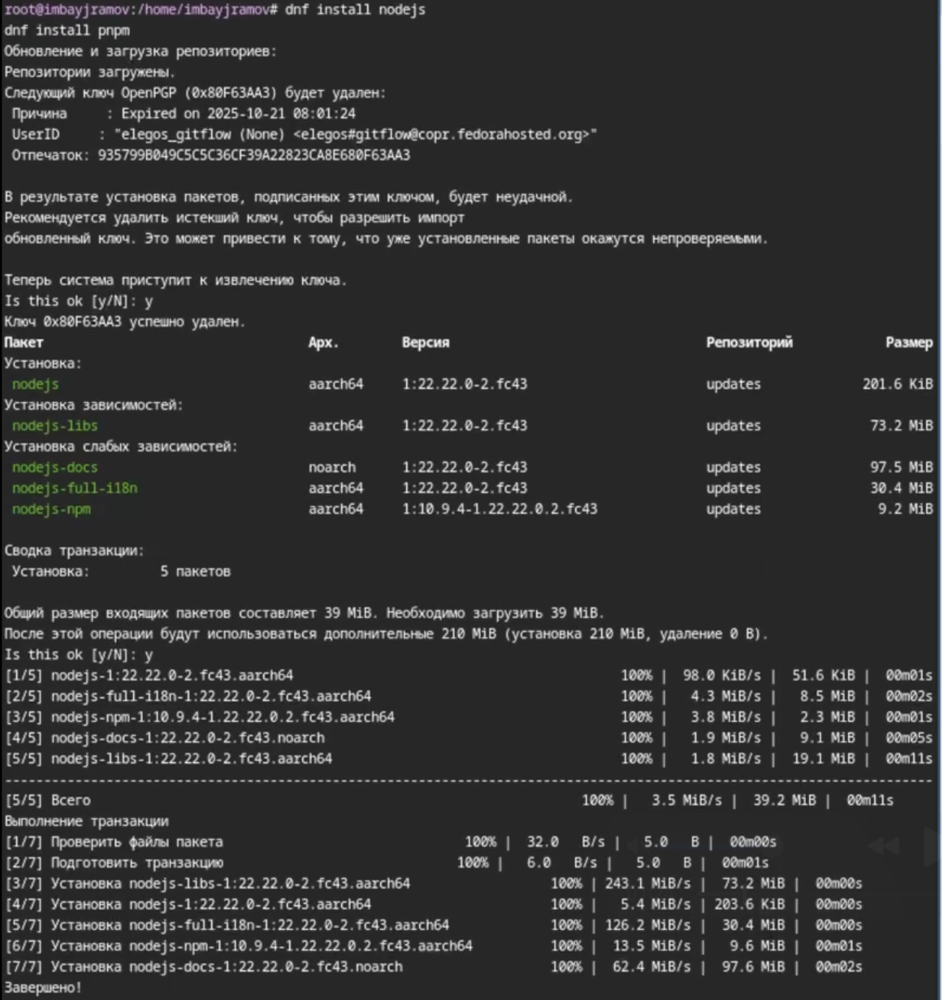
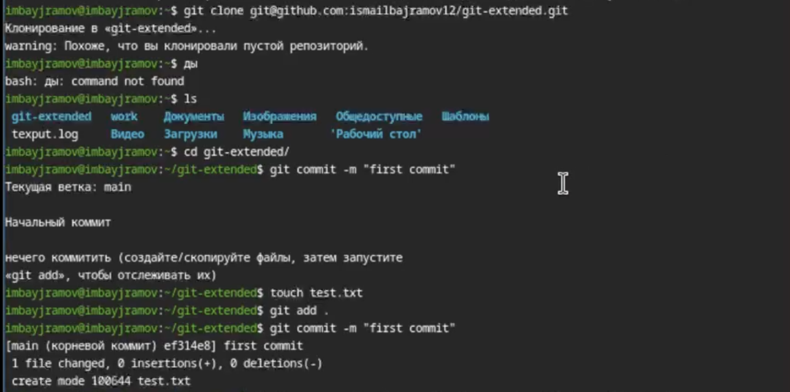
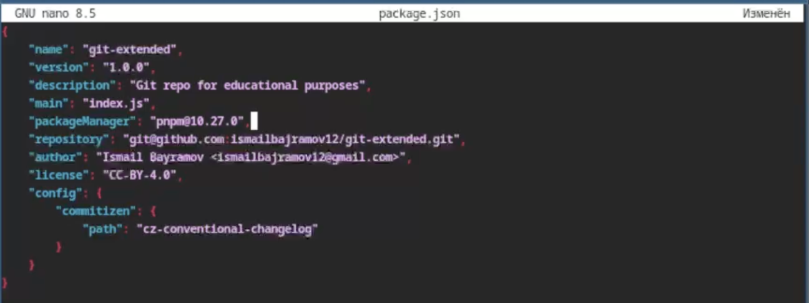
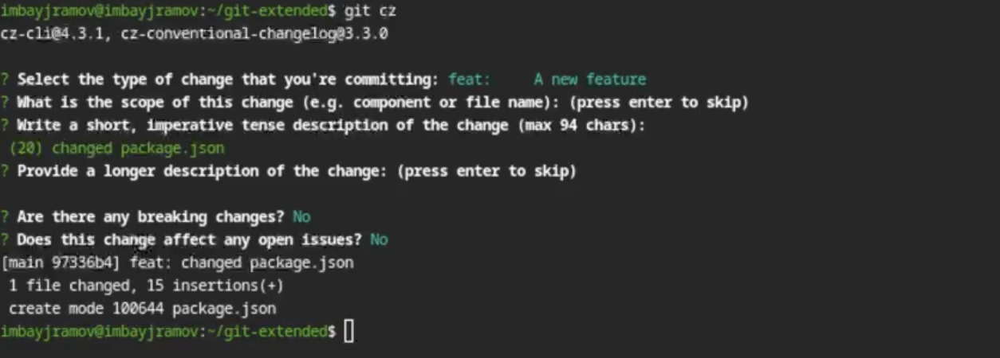
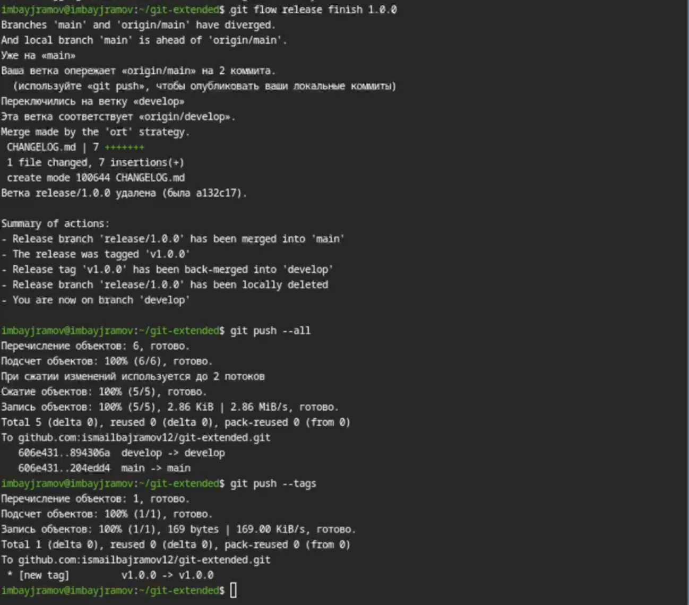
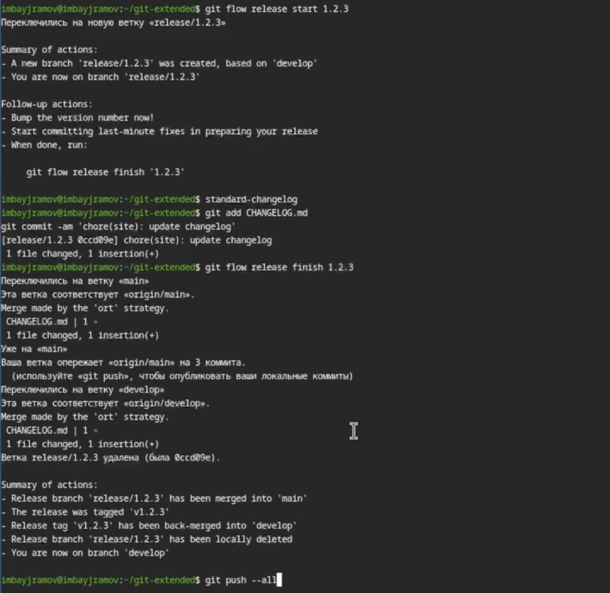

---
## Author
author:
  name: Байрамов Исмаил Мухандис оглы
  email: 1032253514@rudn.ru
  affiliation:
    - name: Российский университет дружбы народов
      city: Москва
      country: Россия

## Title
title: "Отчет по лабораторной работе"
subtitle: "Gitflow и Conventional Commits"
license: "CC BY"
---

# Цель работы

Получение навыков правильной работы с репозиториями git.

# Задание

1. Выполнить работу на тестовом репозитории.
2. Преобразовать рабочий репозиторий в репозиторий, использующий **git-flow** и **conventional commits**.

# Теоретическое введение

## Модель ветвления Gitflow
**Gitflow** — это модель организации разработки программного обеспечения, основанная на использовании нескольких веток Git для управления процессом разработки и выпуска версий.
В рамках Gitflow используются две основные ветки:
* **master** — содержит стабильные версии проекта (релизы);
* **develop** — используется для объединения новых функций и текущей разработки.
Для инициализации структуры Gitflow в существующем репозитории используется команда:
```bash
git flow init
```
Помимо основных веток используются вспомогательные ветки:
* **feature** — ветки для разработки новых функций;
* **release** — ветки для подготовки новой версии проекта;
* **hotfix** — ветки для срочного исправления ошибок в релизной версии.
Функциональные ветки создаются на основе ветки **develop** и после завершения работы объединяются обратно с ней.
Создание ветки feature:
```bash
git flow feature start feature_name
```
Завершение работы:
```bash
git flow feature finish feature_name
```
Для подготовки новой версии проекта используется ветка **release**, которая создаётся из ветки develop.
```bash
git flow release start 1.0.0
git flow release finish 1.0.0
```
Если необходимо быстро исправить ошибку в стабильной версии, используется ветка **hotfix**, которая создаётся от ветки master.
```bash
git flow hotfix start hotfix_name
git flow hotfix finish hotfix_name
```

---

## Семантическое версионирование
** Семантическое версионирование (Semantic Versioning, SemVer) ** — это система нумерации версий программного обеспечения.
Версия программы имеет формат:
```
MAJOR.MINOR.PATCH
```
где:
* MAJOR * — увеличивается при несовместимых изменениях API;
* MINOR * — увеличивается при добавлении новой функциональности;
* PATCH * — увеличивается при исправлении ошибок.
Такая система позволяет легко понять характер изменений между версиями программного продукта.
---
## Conventional Commits
** Conventional Commits ** — это соглашение о структуре сообщений коммитов, которое используется для стандартизации истории изменений проекта.
Формат сообщения коммита:
```
<type>(<scope>): <description>
```
Основные типы коммитов:
* **feat** — добавление новой функциональности;
* **fix** — исправление ошибок;
* **docs** — изменения в документации;
* **refactor** — изменение кода без добавления функциональности;
* **test** — добавление или изменение тестов;
* **style** — изменения форматирования кода.
Использование стандартизированных сообщений коммитов позволяет автоматически формировать **журнал изменений (changelog)** и упрощает управление версиями проекта.

# Выполнение лабораторной работы

## Установка необходимого программного обеспечения

Сначала были установлены **Node.js**, пакетный менеджер **pnpm**, а также инструмент **git-flow**.

{#fig:001 width=70%}

## Установка дополнительных инструментов

Далее через пакетный менеджер **pnpm** были установлены инструменты **commitizen** и **standard-changelog**, которые используются для работы с conventional commits и генерации журнала изменений.

{#fig:002 width=70%}

## Создание тестового репозитория

Был создан новый репозиторий и выполнен первый коммит.

{#fig:003 width=70%}

## Настройка Conventional Commits

В директории проекта был настроен механизм conventional commits путем редактирования файла **package.json**.

{#fig:004 width=70%}

## Создание коммита и отправка в удаленный репозиторий

После внесения изменений был создан новый коммит и отправлен в удалённый репозиторий на GitHub.

{#fig:005 width=70%}

## Инициализация git-flow и создание релиза

Далее в репозитории был инициализирован **git-flow**, после чего был создан первый релиз в ветке **develop**.

{#fig:006 width=70%}

## Создание changelog и завершение релиза

С помощью **standard-changelog** был создан список изменений проекта, после чего релиз был завершён и отправлен на GitHub.

{#fig:007 width=70%}

## Работа с новой функциональностью

Была создана новая ветка **feature** для разработки дополнительной функциональности.  
После завершения работы изменения были объединены и опубликованы в репозитории.

{#fig:008 width=70%}

# Выводы

В ходе выполнения лабораторной работы были изучены методы организации разработки с использованием **Gitflow Workflow**, а также принципы **семантического версионирования** и **Conventional Commits**.

В результате были получены практические навыки:

- работы с моделью ветвления **git-flow**;
- создания и управления релизами;
- использования **conventional commits**;
- автоматической генерации **changelog**.

# Список литературы{.unnumbered}

::: {#refs}
:::
