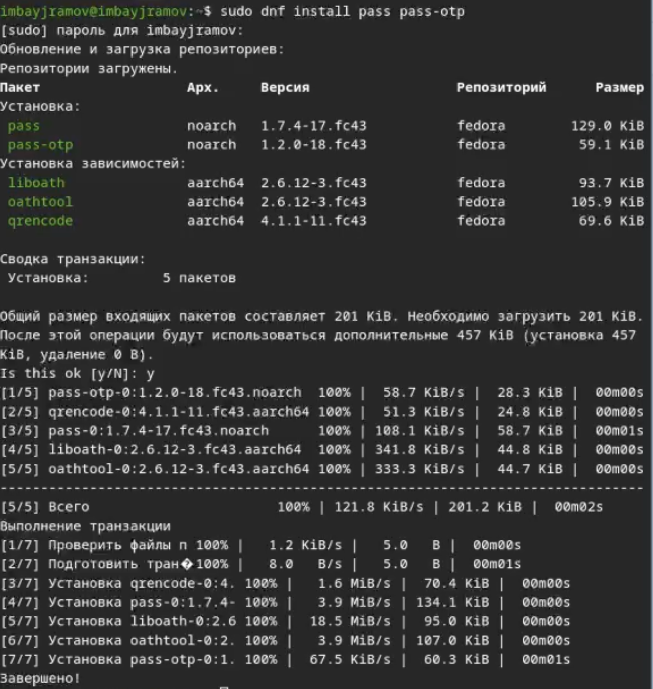
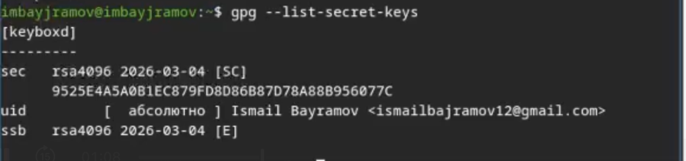
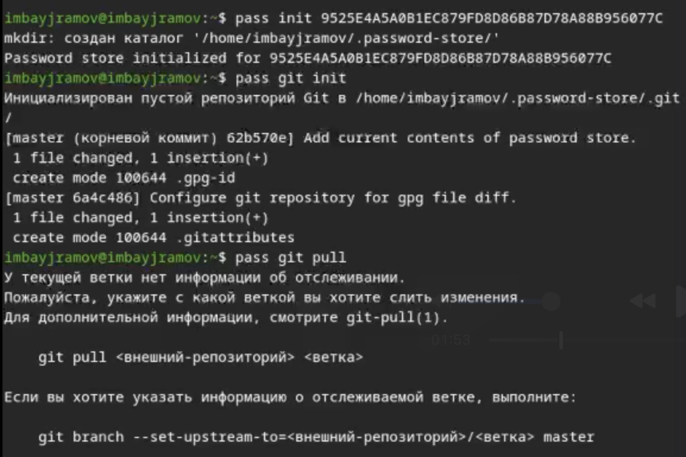
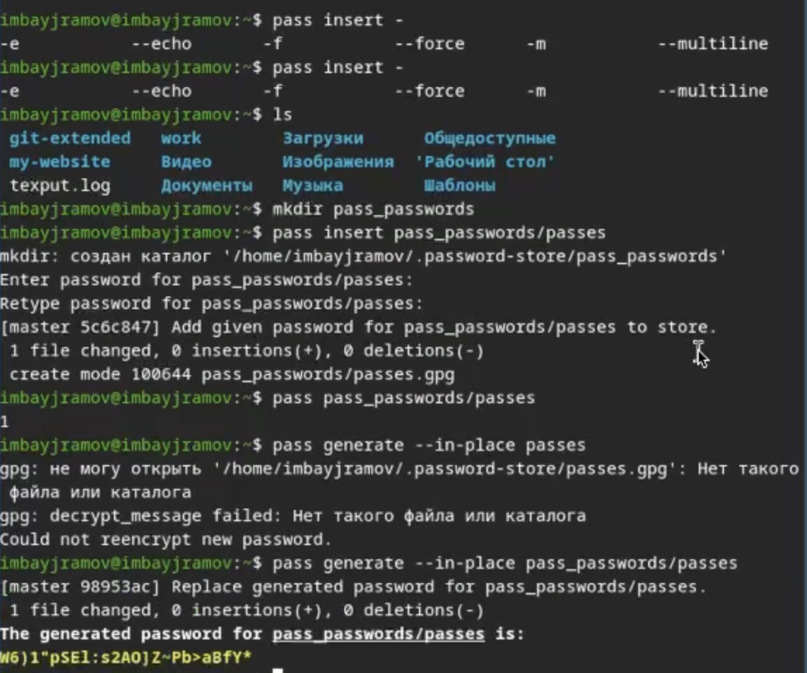

---
## Author
author:
  name: Байрамов Исмаил Мухандис оглы
  email: 1032253514@rudn.ru
  affiliation:
    - name: Российский университет дружбы народов
      country: Российская Федерация
      postal-code: 117198
      city: Москва
      address: ул. Миклухо-Маклая, д. 6

## Title
title: "Лабораторная работа №5"
license: "CC BY"
---

# Информация

## Докладчик

:::::::::::::: {.columns align=center}
::: {.column width="70%"}

* Байрамов Исмаил Мухандис оглы
* Студент РУДН
* Направление: Компьютерные и информационные науки
* Российский университет дружбы народов
* 1032253514@rudn.ru

:::
::: {.column width="30%"}


:::
::::::::::::::

# Вводная часть

## Цель работы

- Изучить менеджер паролей **pass**
- Освоить работу с **GPG‑ключами**
- Изучить управление конфигурациями через **chezmoi**
- Научиться синхронизировать конфигурации с помощью **git**

## Задание

1. Установить менеджер паролей **pass**
2. Создать **GPG‑ключ**
3. Инициализировать хранилище паролей
4. Добавить и просмотреть пароль
5. Установить и настроить **chezmoi**
6. Создать репозиторий конфигураций

# Теоретическое введение

## Менеджер паролей pass

**pass** — стандартный менеджер паролей для Unix.

Основные свойства:

- хранение паролей в виде файлов
- использование иерархии каталогов
- шифрование данных с помощью **GPG**
- возможность синхронизации через **git**

## Структура базы паролей

Пример структуры:

```text
.password-store/
example.com.pgp
example.com/user.pgp
user@example.com.pgp
example.com:22.pgp
```

Каждый пароль хранится в отдельном зашифрованном файле.

# Выполнение работы

## Установка pass

Команда установки:

```bash
dnf install pass pass-otp
```

### Скриншот установки



# Создание GPG ключа

Создание ключа:

```bash
gpg --full-generate-key
```

Просмотр ключей:

```bash
gpg --list-secret-keys
```

### Скриншот создания ключа



# Инициализация password store

Инициализация хранилища:

```bash
pass init <gpg-id>
```

После выполнения создаётся каталог:

```
~/.password-store
```

### Скриншот инициализации



# Добавление пароля

Добавление записи:

```bash
pass insert example.com/user
```

Просмотр пароля:

```bash
pass example.com/user
```

### Скриншот добавления пароля



# Синхронизация с git

Инициализация git‑репозитория:

```bash
pass git init
```

Отправка изменений:

```bash
pass git push
```

Получение изменений:

```bash
pass git pull
```

# Управление конфигурациями chezmoi

**chezmoi** — инструмент управления пользовательскими конфигурационными файлами.

Позволяет:

- хранить настройки системы в **git**
- применять конфигурацию на разных машинах
- использовать шаблоны конфигурации

# Установка chezmoi

Установка:

```bash
sh -c "$(wget -qO- chezmoi.io/get)"
```

Инициализация репозитория:

```bash
chezmoi init git@github.com:<username>/dotfiles.git
```

### Скриншот chezmoi


# Результаты работы

В ходе лабораторной работы:

- установлен менеджер паролей **pass**
- создан **GPG‑ключ**
- инициализировано хранилище паролей
- добавлены записи паролей
- настроена синхронизация через **git**
- установлен инструмент **chezmoi**
- создан репозиторий конфигураций

# Вывод

В ходе лабораторной работы был изучен менеджер паролей **pass**, позволяющий безопасно хранить пароли с использованием шифрования **GPG**.

Также был изучен инструмент **chezmoi**, позволяющий управлять конфигурационными файлами пользователя и синхронизировать их между несколькими системами.

Использование данных инструментов упрощает управление рабочей средой и повышает безопасность хранения паролей.
