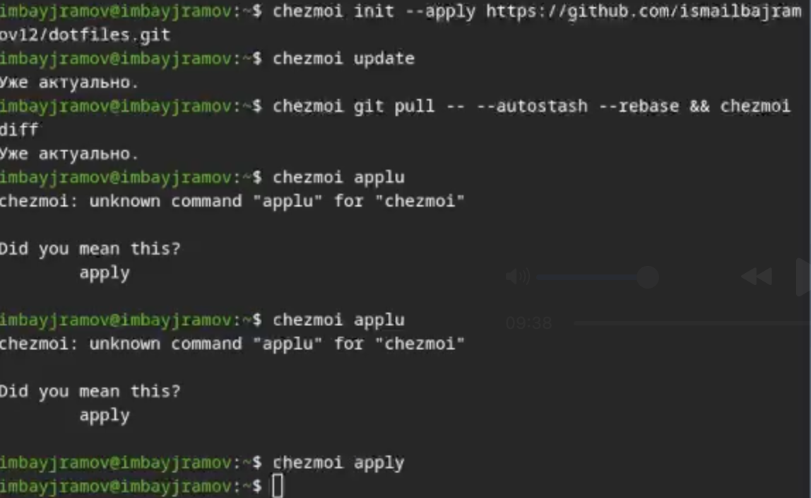

---
## Author
author:
  name: Байрамов Исмаил Мухандис оглы
  email: 1032253514@rudn.ru
  affiliation:
    - name: Российский университет дружбы народов
      country: Российская Федерация
      postal-code: 117198
      city: Москва
      address: ул. Миклухо-Маклая, д. 6

## Title
title: "Отчет по лабораторной работе 5"
license: "CC BY"
---

# Цель работы

Целью лабораторной работы является изучение принципов работы менеджера паролей `pass`, а также освоение инструментов управления конфигурационными файлами пользователя с помощью утилиты `chezmoi`.

В процессе выполнения работы необходимо:

- установить и настроить менеджер паролей `pass`;
- создать и настроить `GPG`-ключ для шифрования паролей;
- инициализировать хранилище паролей;
- выполнить сохранение и просмотр пароля;
- установить и настроить `chezmoi` для управления конфигурационными файлами;
- создать собственный репозиторий `dotfiles`;
- применить конфигурацию на системе.

# Теоретические сведения

## Менеджер паролей pass

`pass` — это менеджер паролей, реализованный в рамках философии Unix. Он хранит пароли в виде обычных файлов в файловой системе, а сами файлы шифруются с использованием `GPG`.

Основные свойства `pass`:

- хранение данных в виде каталогов и файлов;
- шифрование файлов с помощью `GPG`-ключа;
- возможность произвольной структуры базы паролей;
- поддержка синхронизации через `git`.

Пример семантической структуры базы паролей:

```text
example.com.pgp
example.com/user.pgp
user@example.com.pgp
example.com:22.pgp
example.com:22/user.pgp
user@example.com:22.pgp
```

## Управление файлами конфигурации chezmoi

`chezmoi` — это инструмент для управления конфигурационными файлами пользователя (`dotfiles`). Он позволяет хранить конфигурацию в git-репозитории, применять её на разных машинах и использовать шаблоны для создания системно-зависимых конфигураций.

Рабочий каталог `chezmoi`:

```bash
~/.local/share/chezmoi
```

Конфигурационный файл:

```bash
~/.config/chezmoi/chezmoi.toml
```

При выполнении команды:

```bash
chezmoi apply
```

утилита вычисляет желаемое состояние файлов и приводит рабочую систему в соответствие с ним.

# Ход выполнения работы

## 1. Установка менеджера паролей pass

Для установки `pass` и дополнительного модуля `pass-otp` использовалась команда:

```bash
dnf install pass pass-otp
```

### Скриншот 1

скриншот установки `pass` через терминал.


## 2. Создание GPG-ключа

Для работы `pass` необходимо наличие секретного `GPG`-ключа. Для проверки списка ключей используется команда:

```bash
gpg --list-secret-keys
```

Если ключ отсутствует, создаётся новый:

```bash
gpg --full-generate-key
```

### Скриншот 2

скриншот вывода команды `gpg --list-secret-keys` или процесса генерации ключа.


## 3. Инициализация хранилища паролей

После создания ключа выполняется инициализация хранилища:

```bash
pass init <gpg-id или email>
```

После этого создаётся каталог `~/.password-store`, который используется для хранения зашифрованных записей.

### Скриншот 3

скриншот выполнения команды `pass init <gpg-id>`.


## 4. Сохранение и просмотр пароля

Для добавления нового пароля используется команда:

```bash
pass insert example.com/user
```

Для просмотра сохранённого пароля:

```bash
pass example.com/user
```

Для замены существующего пароля можно использовать:

```bash
pass generate --in-place example.com/user
```

### Скриншот 4

скриншот добавления и просмотра пароля.


## 5. Синхронизация хранилища с git

Для инициализации git-репозитория внутри хранилища используется команда:

```bash
pass git init
```

Далее можно подключить удалённый репозиторий:

```bash
pass git remote add origin git@github.com:<git_username>/<git_repo>.git
```

Для синхронизации выполняются команды:

```bash
pass git pull
pass git push
```

Проверка состояния репозитория:

```bash
pass git status
```

## 6. Установка chezmoi

Установка `chezmoi` может быть выполнена с помощью команды:

```bash
sh -c "$(wget -qO- chezmoi.io/get)"
```

После установки создаётся собственный репозиторий конфигурационных файлов.

Пример создания репозитория:

```bash
gh repo create dotfiles --template="yamadharma/dotfiles-template" --private
```

## 7. Подключение репозитория к системе

Для инициализации `chezmoi` с репозиторием используется команда:

```bash
chezmoi init git@github.com:<username>/dotfiles.git
```

Для предварительного просмотра изменений:

```bash
chezmoi diff
```

Для применения конфигурации:

```bash
chezmoi apply -v
```

### Скриншот 5

скриншот инициализации `chezmoi` и применения конфигурации.



## 8. Использование chezmoi на нескольких машинах

На новой машине настройка может быть выполнена одной командой:

```bash
chezmoi init --apply https://github.com/<username>/dotfiles.git
```

Либо через `ssh`:

```bash
chezmoi init --apply git@github.com:<username>/dotfiles.git
```

Для обновления конфигурации используется команда:

```bash
chezmoi update
```

# Результаты работы

В ходе лабораторной работы были выполнены следующие действия:

- установлен и настроен менеджер паролей `pass`;
- создан `GPG`-ключ для шифрования паролей;
- инициализировано хранилище паролей;
- добавлен и просмотрен пароль;
- изучен механизм синхронизации хранилища с `git`;
- установлен и настроен `chezmoi`;
- рассмотрены способы управления конфигурационными файлами и шаблонами.

# Вывод

В ходе выполнения лабораторной работы были изучены возможности менеджера паролей `pass`, предназначенного для безопасного хранения паролей с использованием шифрования `GPG`. Было показано, что `pass` позволяет организовать удобную иерархическую структуру хранения данных и синхронизировать её через `git`.

Также был изучен инструмент `chezmoi`, предназначенный для управления пользовательскими конфигурационными файлами. Использование `chezmoi` позволяет централизованно хранить и применять настройки рабочей среды, а также быстро переносить их на новые машины. Таким образом, оба инструмента являются полезными средствами для организации безопасной и удобной рабочей среды пользователя.
