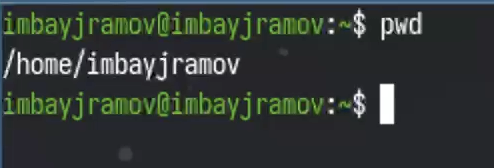
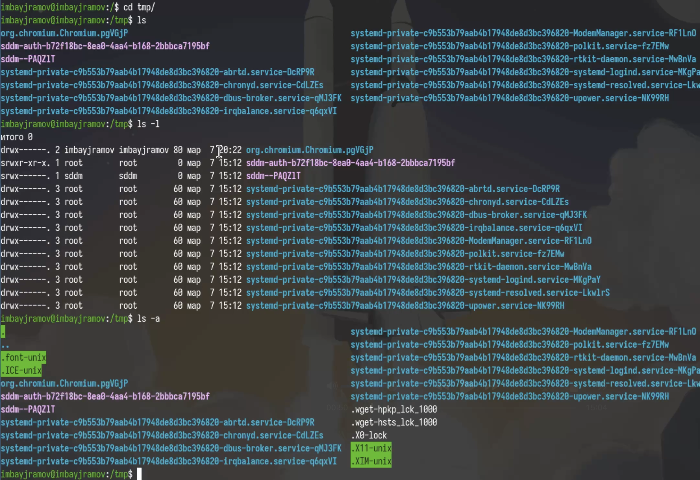
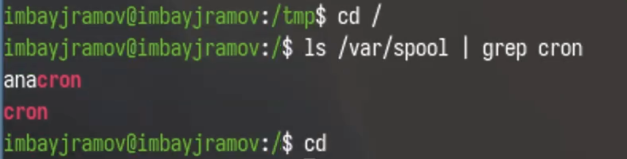
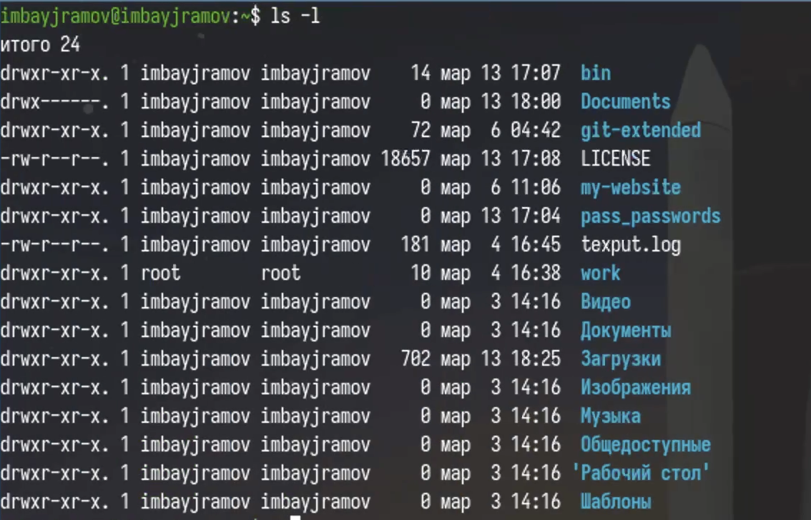
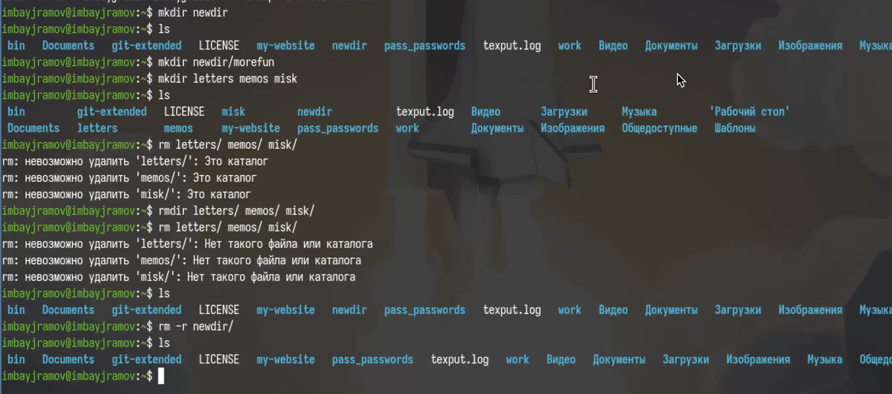
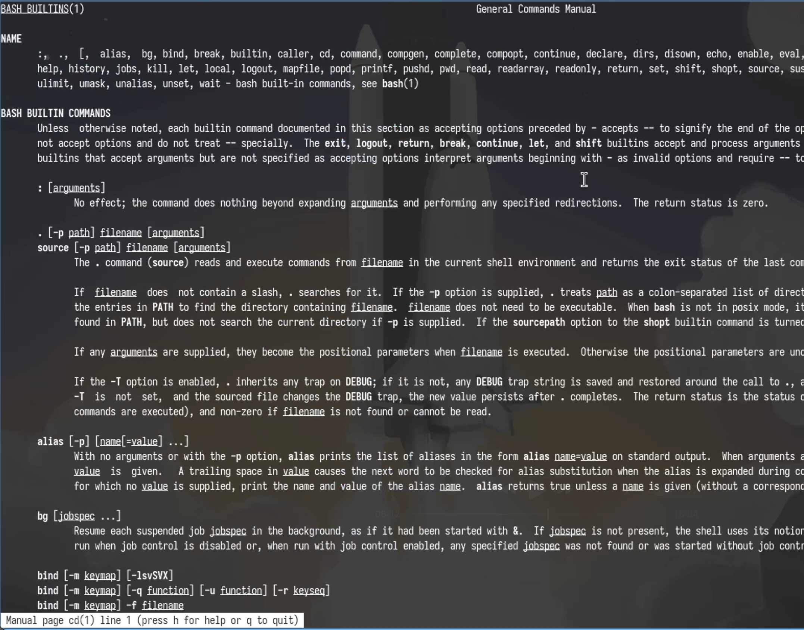

---
## Author
author:
  name: Байрамов Исмаил Мухандис оглы
  email: 1032253514@rudn.ru
  affiliation:
    - name: Российский университет дружбы народов
      country: Российская Федерация
      postal-code: 117198
      city: Москва
      address: ул. Миклухо-Маклая, д. 6

## Title
title: "Лабораторная работа №6"
license: "CC BY"
---

# Информация

## Докладчик

:::::::::::::: {.columns align=center}
::: {.column width="70%"}

* Байрамов Исмаил Мухандис оглы
* Студент РУДН
* Направление: Компьютерные и информационные науки
* Российский университет дружбы народов
* 1032253514@rudn.ru

:::
::: {.column width="30%"}


:::
::::::::::::::

# Вводная часть

## Цель работы

- Освоить работу с командной строкой Linux
- Изучить основные команды shell
- Научиться работать с файлами и каталогами
- Освоить команды `history` и `man`

## Задание

1. Определить текущий каталог
2. Изучить команды `ls`, `cd`, `pwd`
3. Создать и удалить каталоги
4. Использовать `history`
5. Изучить справку через `man`

# Теоретическое введение

## Командная строка

Командная строка — это текстовый интерфейс взаимодействия пользователя с системой.

Формат команды:

```bash
команда [аргументы]
```

## Основные команды

- `cd` — переход между каталогами
- `pwd` — текущий каталог
- `ls` — список файлов
- `mkdir` — создание каталогов
- `rm` — удаление
- `history` — история команд
- `man` — справка

# Выполнение работы

## Определение каталога

```bash
pwd
```



# Работа с каталогом /tmp

```bash
cd /tmp
ls
ls -l
ls -a
```



# Проверка каталога cron

```bash
ls /var/spool
```



# Работа с домашним каталогом

```bash
cd ~
ls -l
```



# Создание каталогов

```bash
mkdir newdir
mkdir ~/newdir/morefun
mkdir letters memos misk
```

Удаление:

```bash
rm -r letters memos misk
```



# Использование man и history

```bash
man ls
history
!5
```



# Результаты работы

- Освоены основные команды Linux
- Изучена навигация по файловой системе
- Выполнено создание и удаление каталогов
- Изучена работа с history и man

# Вывод

В ходе лабораторной работы были получены базовые навыки работы с командной строкой Unix/Linux.

Командная строка является важным инструментом управления системой и необходима для работы в Linux.
