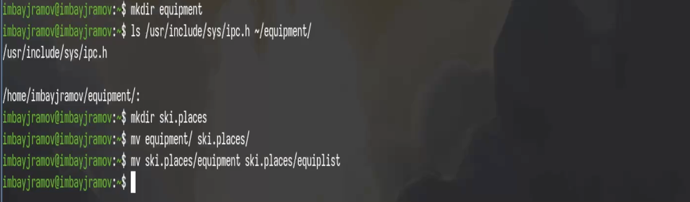
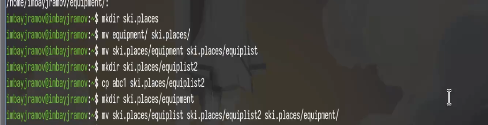
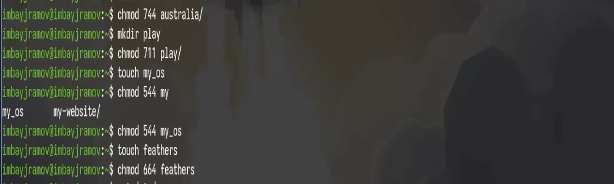
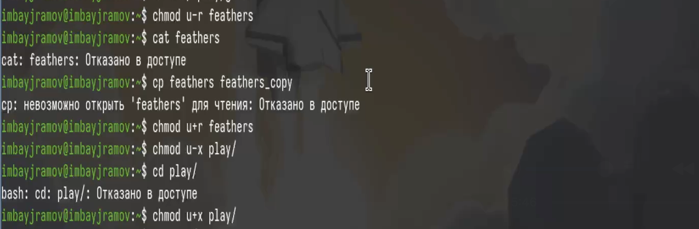

---
## Author
author:
  name: Байрамов Исмаил Мухандис оглы
  email: 1032253514@rudn.ru
  affiliation:
    - name: Российский университет дружбы народов
      city: Москва
      country: Россия

## Title
title: "Отчет по лабораторной работе 7"
subtitle: "Анализ файловой системы Linux. Команды для работы с файлами и каталогами"
license: "CC BY"
---

# Цель работы

Ознакомление с файловой системой Linux, ее структурой, именами и содержанием каталогов. Приобретение практических навыков по применению команд для работы с файлами и каталогами, по управлению процессами, по проверке использования диска и обслуживанию файловой системы.


# Ход работы

## 1. Копирование и перемещение файлов

```bash
cp /usr/include/sys/types.h ~/equipment
mkdir ~/ski.plases
mv ~/equipment ~/ski.plases/
mv ~/ski.plases/equipment ~/ski.plases/equiplist
```



```bash
$ cp /usr/include/sys/types.h ~/equipment
$ mkdir ~/ski.plases
$ mv ~/equipment ~/ski.plases/
$ ls ~/ski.plases
equipment
```

---

## 2. Работа с файлами и каталогами

```bash
touch ~/abc1
cp ~/abc1 ~/ski.plases/equiplist2
mkdir ~/ski.plases/equipment
mv ~/ski.plases/equiplist ~/ski.plases/equiplist2 ~/ski.plases/equipment/
```



```bash
$ touch ~/abc1
$ cp ~/abc1 ~/ski.plases/equiplist2
$ mkdir ~/ski.plases/equipment
$ mv ~/ski.plases/equiplist ~/ski.plases/equiplist2 ~/ski.plases/equipment/
$ ls ~/ski.plases/equipment
equiplist equiplist2
```

---

## 3. Права доступа

```bash
mkdir australia
chmod 744 australia

mkdir play
chmod 711 play

touch my_os
chmod 544 my_os

touch feathers
chmod 664 feathers
```



```bash
$ ls -l
drwxr--r--  australia
drwx--x--x  play
-r-xr--r--  my_os
-rw-rw-r--  feathers
```

---

## 4. Проверка прав доступа

```bash
chmod u-r ~/feathers
cat ~/feathers
cp ~/feathers ~/copy
chmod u+r ~/feathers
```



```bash
$ chmod u-r feathers
$ cat feathers
cat: feathers: Permission denied

$ cp feathers copy
cp: cannot open 'feathers' for reading: Permission denied
```

---

## 5. Работа с каталогами

```bash
chmod u-x ~/play
cd ~/play

chmod u+x ~/play
cd ~/play
```

---

## 6. Просмотр системной информации

```bash
cat /etc/passwd
df
mount
```

---

## 7. Изучение справки

```bash
man mount
man fsck
man mkfs
man kill
```

# Вывод

В ходе лабораторной работы были изучены основные команды Linux для работы с файлами и каталогами (cp, mv, touch, mkdir), а также команды управления правами доступа (chmod). Получены навыки анализа файловой системы с использованием команд df, mount, fsck.

# Ответы на контрольные вопросы

## 1. Типы файловых систем
ext4, xfs, ntfs, fat.

## 2. Структура файловой системы
/, /home, /etc, /dev, /proc.

## 3. Доступ к файловой системе
Необходимо выполнить монтирование (mount).

## 4. Причины повреждения
Сбои питания, ошибки диска. Используется fsck.

## 5. Создание файловой системы
mkfs.

## 6. Просмотр файлов
cat, less, head, tail.

## 7. Возможности cp
Копирование файлов и каталогов.

## 8. Возможности mv
Перемещение и переименование.

## 9. Права доступа
r, w, x. Изменяются chmod.
