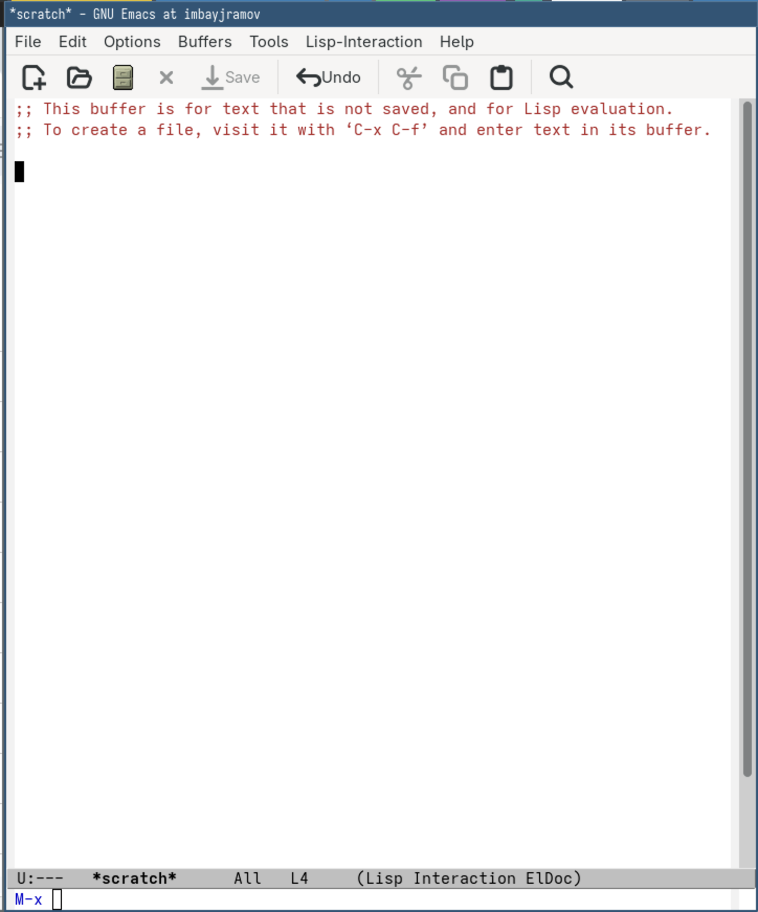
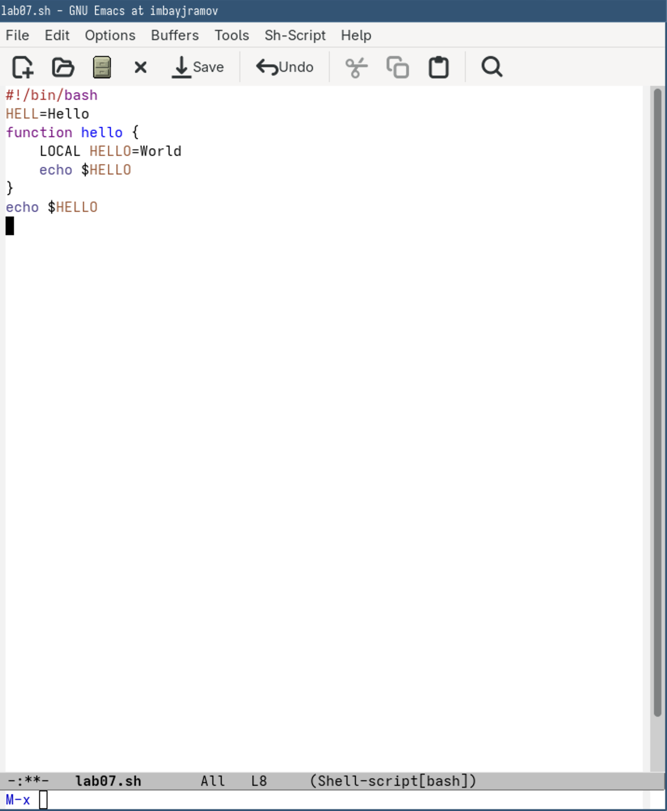
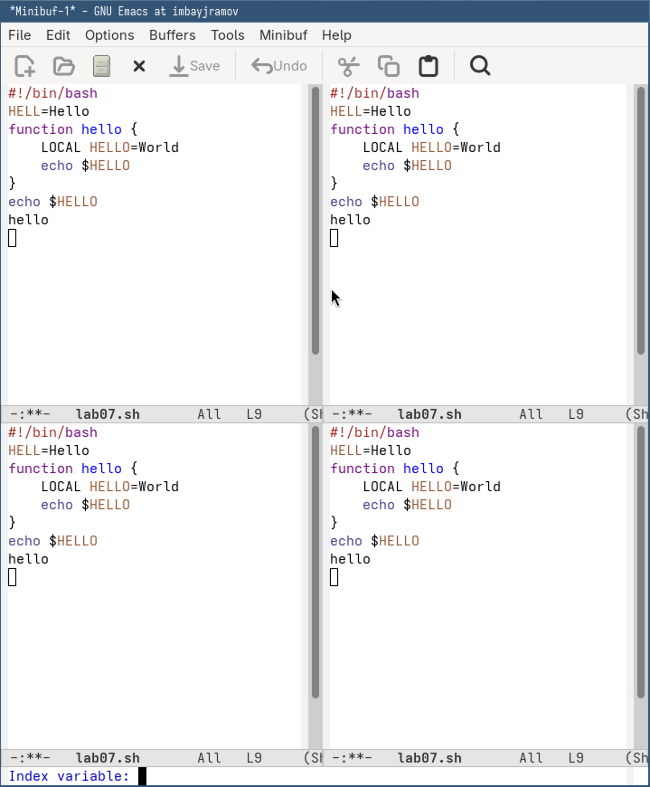

## Author
author:
  name: Байрамов Исмаил Мухандис оглы
  email: 1032253514@rudn.ru
  affiliation:
    - name: Российский университет дружбы народов
      country: Российская Федерация
      postal-code: 117198
      city: Москва
      address: ул. Миклухо-Маклая, д. 6

## Title
title: "Лабораторная работа №11"
license: "CC BY"
---

# Информация

## Докладчик

:::::::::::::: {.columns align=center}
::: {.column width="70%"}

* Байрамов Исмаил Мухандис оглы
* Студент РУДН
* Направление: Компьютерные и информационные науки
* Российский университет дружбы народов
* 1032253514@rudn.ru

:::
::: {.column width="30%"}

:::
::::::::::::::

# Введение

## Актуальность

* Linux широко используется в профессиональной среде
* Emacs — мощный инструмент для работы с текстом
* Повышает продуктивность разработчика
* Требует практического освоения

## Цель и задачи

**Цель:**
Освоить основы работы в Emacs

**Задачи:**

* Создание и редактирование файлов
* Работа с буферами и окнами
* Освоение горячих клавиш
* Использование поиска и замены

# Теоретическая часть

## Основные понятия

* **Буфер** — текст или данные
* **Окно** — отображение буфера
* **Фрейм** — окно приложения
* **Минибуфер** — ввод команд

## Особенности Emacs

* Написан на Lisp
* Поддерживает расширения
* Управляется с клавиатуры
* Имеет множество режимов

# Практическая часть

## Работа в Emacs

Через Emacs создаётся и редактируется файл.

{ width=80% }

## Редактирование текста

Использование горячих клавиш для редактирования:

* Вырезание строки (C-k)
* Вставка (C-y)
* Копирование (M-w)
* Отмена (C-/)

{ width=80% }

## Работа с окнами и поиском

* Разделение окна на несколько частей
* Работа с несколькими буферами
* Поиск и замена текста

{ width=80% }

# Выполненные операции

## Основные действия

* Создан файл `lab07.sh`
* Выполнено редактирование текста
* Освоены команды перемещения
* Использован поиск и замена

## Работа с окнами

* Разделение экрана на 4 части
* Работа с несколькими файлами одновременно

# Результаты

## Полученные навыки

* Уверенная работа в Emacs
* Использование горячих клавиш
* Управление буферами и окнами
* Навигация по тексту

## Практическая значимость

* Ускорение работы с кодом
* Повышение эффективности
* Подготовка к реальной работе в Linux

# Контрольные вопросы

## Основные ответы

* Emacs — мощный редактор на Lisp
* Буфер — текст, окно — отображение
* Можно работать с множеством буферов
* Настройки хранятся в `.emacs`

# Выводы

* Освоены основы работы в Emacs
* Получены практические навыки
* Изучены ключевые команды
* Подтверждена эффективность работы через клавиатуру

